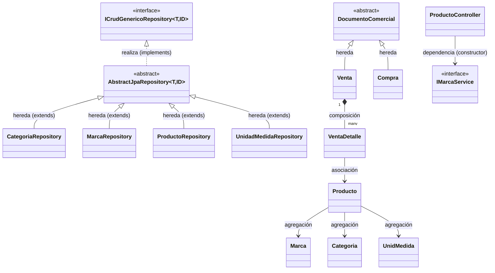

# Manual Didáctico — Construcción de SysVentas (JavaFX + Maven)

> Sistema de ventas de escritorio construido con **Java 21**, **JavaFX 21**, **Maven**, **ControlsFX**, **Lombok**, **Jakarta Validation / Hibernate Validator** y una arquitectura en capas **Model → Repository → Service → Controller → View (FXML)**, con **inyección de dependencias manual** (sin Spring).
>
> Este manual es **secuencial**: si creas cada archivo en el orden en que aparece, al final tendrás el proyecto completo, compilable y ejecutable. Todo el código fuente del proyecto real está incluido — no hay fragmentos incompletos.

---

## Índice

1. [Visión general de la arquitectura](#1-visión-general-de-la-arquitectura)
2. [Conceptos de POO aplicados](#2-conceptos-de-poo-aplicados)
3. [Patrones de diseño aplicados](#3-patrones-de-diseño-aplicados)
4. [Tipos de relaciones entre clases (UML)](#4-tipos-de-relaciones-entre-clases-uml)
5. [Requisitos previos](#5-requisitos-previos)
6. [Paso 0 — Crear el proyecto Maven y su estructura](#6-paso-0--crear-el-proyecto-maven-y-su-estructura)
7. [Paso 1 — `pom.xml` (dependencias)](#7-paso-1--pomxml-dependencias)
8. [Paso 2 — `module-info.java` (Java Platform Module System)](#8-paso-2--module-infojava-java-platform-module-system)
9. [Paso 3 — Paquete `enums`](#9-paso-3--paquete-enums)
10. [Paso 4 — Paquete `exception`](#10-paso-4--paquete-exception)
11. [Paso 5 — Paquete `model` (entidades base del CRUD)](#11-paso-5--paquete-model-entidades-base-del-crud)
12. [Paso 6 — Paquete `dto`](#12-paso-6--paquete-dto)
13. [Paso 7 — Paquete `repository` (capa de acceso a datos)](#13-paso-7--paquete-repository-capa-de-acceso-a-datos)
14. [Paso 8 — Paquete `service` (capa de negocio)](#14-paso-8--paquete-service-capa-de-negocio)
15. [Paso 9 — Paquete `components` (utilidades de UI reutilizables)](#15-paso-9--paquete-components-utilidades-de-ui-reutilizables)
16. [Paso 10 — Recursos gráficos necesarios](#16-paso-10--recursos-gráficos-necesarios)
17. [Paso 11 — Paquete `config` (contenedor de Inyección de Dependencias)](#17-paso-11--paquete-config-contenedor-de-inyección-de-dependencias)
18. [Paso 12 — Paquete `controller` (capa de presentación / MVC)](#18-paso-12--paquete-controller-capa-de-presentación--mvc)
19. [Paso 13 — Vistas FXML](#19-paso-13--vistas-fxml)
20. [Paso 14 — Hoja de estilos CSS](#20-paso-14--hoja-de-estilos-css)
21. [Paso 15 — Arranque de la aplicación (`App` y `SysVentas`)](#21-paso-15--arranque-de-la-aplicación-app-y-sysventas)
22. [Paso 16 — Ejecutar el proyecto](#22-paso-16--ejecutar-el-proyecto)
23. [Paso 17 — Recorrido funcional: qué ocurre al hacer clic en "Guardar"](#23-paso-17--recorrido-funcional-qué-ocurre-al-hacer-clic-en-guardar)
24. [Anexo A — Modelos adicionales del dominio (Ventas, Compras, Usuarios)](#24-anexo-a--modelos-adicionales-del-dominio-ventas-compras-usuarios)
25. [Anexo B — Receta para agregar un nuevo módulo CRUD](#25-anexo-b--receta-para-agregar-un-nuevo-módulo-crud)
26. [Anexo C — Limitaciones actuales y mejoras sugeridas](#26-anexo-c--limitaciones-actuales-y-mejoras-sugeridas)
27. [Glosario](#27-glosario)

---

## 1. Visión general de la arquitectura

SysVentas sigue una **arquitectura en capas** (*Layered Architecture*), donde cada capa tiene una única responsabilidad y solo conoce a la capa inmediatamente inferior:

```
┌─────────────────────────────────────────────────────────────┐
│  VIEW (FXML)              maingui.fxml, main_producto.fxml   │
│  — Define la interfaz gráfica declarativamente (XML)         │
└───────────────────────────┬─────────────────────────────────┘
                             │ fx:controller
┌───────────────────────────▼─────────────────────────────────┐
│  CONTROLLER                MainguiController,                │
│  — Captura eventos de UI   ProductoController                │
│  — Valida y arma el modelo                                   │
└───────────────────────────┬─────────────────────────────────┘
                             │ usa (composición por interfaz)
┌───────────────────────────▼─────────────────────────────────┐
│  SERVICE                   ICategoriaService, IMarcaService,  │
│  — Reglas de negocio        IProductoService, IUnidadMedidaS. │
└───────────────────────────┬─────────────────────────────────┘
                             │ usa (composición por interfaz)
┌───────────────────────────▼─────────────────────────────────┐
│  REPOSITORY                 CategoriaRepository, MarcaRepo.,  │
│  — Acceso a datos            ProductoRepository, UnidadMedRep.│
└───────────────────────────┬─────────────────────────────────┘
                             │ persiste / lee
┌───────────────────────────▼─────────────────────────────────┐
│  MODEL                     Categoria, Marca, Producto,        │
│  — Entidades del dominio    UnidMedida, Venta, Compra...      │
└─────────────────────────────────────────────────────────────┘
```

Capas transversales que usan las anteriores:

- **`config`** → contiene `AppContext`, el contenedor manual de *Inyección de Dependencias* (DI) que **arma** el grafo de objetos de todas las capas anteriores al iniciar la aplicación.
- **`dto`** → objetos de transferencia de datos entre capas, distintos al modelo (p. ej. `ComboBoxOption`, pensado solo para llenar un `ComboBox`).
- **`enums`** → catálogos cerrados de valores (`TipoProducto`, `TipoDocumento`, etc.).
- **`exception`** → excepciones propias del dominio (`ModelNotFoundException`).
- **`components`** → clases de utilidad de UI reutilizables entre distintos controladores (helpers para `TableView`, `ComboBox`, tooltips de error, notificaciones *toast*).

En este proyecto **no hay base de datos real**: cada `Repository` guarda los objetos en una `List` en memoria (patrón *in-memory repository*). Esto permite centrarse en la arquitectura y los patrones sin la complejidad de JDBC/JPA — y es completamente intercambiable después por una implementación real, porque el resto de capas solo conocen **interfaces**.

---

## 2. Conceptos de POO aplicados

| Concepto | Dónde se aplica | Explicación |
|---|---|---|
| **Encapsulamiento** | Todas las clases de `model` (`Categoria`, `Producto`, etc.) | Los atributos son `private`; el acceso se hace por getters/setters generados con Lombok `@Data`. Nadie fuera de la clase modifica el estado directamente. |
| **Abstracción** | `ICrudGenericoRepository<T,ID>`, `ICrudGenericoService<T,ID>`, `AbstractJpaRepository<T,ID>`, `DocumentoComercial` | Se define **qué** hace un repositorio/servicio genérico sin decir **cómo** lo hace cada entidad concreta. |
| **Herencia** | `CategoriaRepository extends AbstractJpaRepository<Categoria, Long>`; `Venta extends DocumentoComercial`; `Compra extends DocumentoComercial`; `CategoriaServiceImp extends CrudGenericoServiceImp<Categoria, Long>` | Reutiliza comportamiento común (CRUD genérico, cálculo de totales) y cada subclase solo añade/ajusta lo específico. |
| **Polimorfismo** | `calcularTotal()` en `Venta` y `Compra` (cada una lo implementa distinto); `getRepo()` en cada `XServiceImp`; el `FXMLLoader` invoca a cada controlador a través de la misma fábrica sin conocer su tipo concreto | El mismo mensaje (`calcularTotal()`, `getBean()`) produce comportamientos distintos según el objeto real en tiempo de ejecución. |
| **Interfaces / contratos** | `ICategoriaService`, `IMarcaService`, `IProductoService`, `IUnidadMedidaService`, `ICrudGenericoRepository`, `ICrudGenericoService` | El `Controller` depende de la **interfaz** del servicio, nunca de la clase concreta → bajo acoplamiento, fácil de testear/mockear. |
| **Genéricos (Generic Programming)** | `<T, ID>` en `ICrudGenericoRepository<T,ID>`, `AbstractJpaRepository<T,ID>`, `ICrudGenericoService<T,ID>`, `CrudGenericoServiceImp<T,ID>` | Un único algoritmo CRUD (`save`, `update`, `findById`, `findAll`, `deleteById`) sirve para `Categoria`, `Marca`, `Producto`, `UnidMedida` sin duplicar código. |
| **Composición** | `Venta` contiene `List<VentaDetalle>`; `Compra` contiene `List<CompraDetalle>` | El detalle **no tiene sentido ni ciclo de vida propio** sin la venta/compra que lo contiene. |
| **Agregación** | `Producto` referencia `Marca`, `Categoria`, `UnidMedida` | Esas entidades **existen independientemente** de `Producto` y pueden asociarse a muchos productos distintos. |
| **Clases inmutables de configuración** | Enums (`TipoProducto`, `Menus`, `TipoTab`, `TipoDocumento`) | Catálogos fijos, type-safe, sin necesidad de comparar Strings mágicos. |

---

## 3. Patrones de diseño aplicados

| Patrón | Clase(s) | Propósito |
|---|---|---|
| **Singleton** | `AppContext` (constructor `private`, `getInstance()` estático y `synchronized`) | Garantiza **una sola instancia** del contenedor de dependencias en toda la aplicación. |
| **Dependency Injection (Contenedor manual / Service Locator)** | `AppContext.registrar()` / `AppContext.getBean()` | Simula lo que hacen Spring/Micronaut: arma objetos e inyecta sus dependencias por **constructor**, resolviéndolas desde un `Map<Class<?>, Object>`. |
| **Template Method** | `AbstractJpaRepository` (define `save/update/findById/findAll/deleteById/existsById`, delega en `getId()/setId()/generateId()` que cada hija implementa) y `CrudGenericoServiceImp` (delega en `getRepo()`) | El **algoritmo general** vive en la clase abstracta; los "huecos" específicos los llena cada subclase. |
| **Repository Pattern** | `CategoriaRepository`, `MarcaRepository`, `ProductoRepository`, `UnidadMedidaRepository` | Aísla el acceso a datos detrás de una interfaz; el resto de la app no sabe si los datos vienen de una `List`, un archivo o una base de datos real. |
| **DTO (Data Transfer Object)** | `ComboBoxOption` | Transporta solo `key`/`value` hacia la vista, sin exponer la entidad completa del dominio en el `ComboBox`. |
| **MVC (Model-View-Controller)** | `model/*` + `view/*.fxml` + `controller/*` | FXML define la vista de forma declarativa; el controlador maneja eventos y arma el modelo; el modelo representa los datos. |
| **Builder** | `@Builder` de Lombok en todas las entidades | Permite construir objetos complejos con sintaxis fluida (`Producto.builder().nombre("...").pu(10.0).build()`) sin telescoping constructors. |
| **Factory Method** | `loader.setControllerFactory(context::getBean)` | El `FXMLLoader` delega la **creación** de cada controlador a una fábrica (`AppContext::getBean`) en lugar de instanciarlo con `new` (así el controlador puede recibir servicios por constructor). |
| **Strategy / Callback (mediante `Consumer<T>`)** | `TableViewHelper.addColumnsInOrderWithSize(..., Consumer<T> updateAction, Consumer<T> deleteAction)` | El comportamiento de los botones "editar"/"eliminar" de cada fila se **inyecta desde afuera** como una función, sin acoplar el helper genérico a `Producto`. |
| **Decorator ligero sobre `ComboBox`** | `ComboBoxAutoComplete<T>` | "Envuelve" un `ComboBox` ya existente añadiéndole comportamiento de autocompletado sin modificar la clase `ComboBox` de JavaFX. |

---

## 4. Tipos de relaciones entre clases (UML)



- **Herencia (generalización)** — flecha con triángulo hueco, `extends`. Ej.: `CategoriaRepository extends AbstractJpaRepository`, `Venta extends DocumentoComercial`.
- **Realización (implementación de interfaz)** — flecha punteada con triángulo hueco, `implements`. Ej.: `AbstractJpaRepository implements ICrudGenericoRepository`.
- **Asociación** — una clase conoce/referencia a otra como atributo, ambas pueden existir por separado. Ej.: `VentaDetalle` referencia a `Producto`.
- **Agregación** ("tiene un", ciclo de vida independiente) — rombo hueco. Ej.: `Producto` referencia `Marca`; si se borra el producto, la marca sigue existiendo.
- **Composición** ("es parte de", ciclo de vida dependiente) — rombo relleno. Ej.: `Venta` contiene `List<VentaDetalle>`; un detalle no tiene sentido sin su venta.
- **Dependencia** (uso temporal, típicamente por parámetro o por inyección en el constructor) — flecha punteada simple. Ej.: `ProductoController` depende de `IMarcaService`, `ICategoriaService`, `IProductoService`, `IUnidadMedidaService`.

---

## 5. Requisitos previos

- **JDK 21** instalado (`java -version` debe mostrar 21.x).
- **Maven 3.9+** (`mvn -version`) — o usar el *Maven Wrapper* si el IDE lo agrega.
- Un IDE con soporte JavaFX (IntelliJ IDEA, Eclipse o NetBeans).
- Conexión a internet la primera vez (Maven descargará las dependencias del `pom.xml`).

---

## 6. Paso 0 — Crear el proyecto Maven y su estructura

Crea la carpeta del proyecto y la siguiente estructura de directorios (puedes generarla a mano o con tu IDE al crear un proyecto Maven vacío):

```
SysVentas/
 ├── pom.xml
 └── src/
     └── main/
         ├── java/
         │   ├── module-info.java
         │   └── pe/edu/upeu/sysventas/
         │       ├── App.java
         │       ├── SysVentas.java
         │       ├── components/
         │       ├── config/
         │       ├── controller/
         │       ├── dto/
         │       ├── enums/
         │       ├── exception/
         │       ├── model/
         │       ├── repository/
         │       └── service/
         │           └── impl/
         └── resources/
             ├── css/
             ├── img/
             └── view/
```

Comando rápido en PowerShell para crear todas las carpetas de una vez (ejecútalo dentro de la carpeta donde quieras crear `SysVentas`):

```bash
mkdir -p SysVentas/src/main/java/pe/edu/upeu/sysventas/{components,config,controller,dto,enums,exception,model,repository,service/impl}
mkdir -p SysVentas/src/main/resources/{css,img,view}
```

---

## 7. Paso 1 — `pom.xml` (dependencias)

Crea `SysVentas/pom.xml`:

```xml
<?xml version="1.0" encoding="UTF-8"?>
<project xmlns="http://maven.apache.org/POM/4.0.0"
         xmlns:xsi="http://www.w3.org/2001/XMLSchema-instance"
         xsi:schemaLocation="http://maven.apache.org/POM/4.0.0 https://maven.apache.org/xsd/maven-4.0.0.xsd">
    <modelVersion>4.0.0</modelVersion>

    <groupId>pe.edu.upeu</groupId>
    <artifactId>SysVentas</artifactId>
    <version>1.0-SNAPSHOT</version>
    <name>SysVentas</name>

    <properties>
        <project.build.sourceEncoding>UTF-8</project.build.sourceEncoding>
        <junit.version>5.12.1</junit.version>
        <hibernate.validator.version>8.0.1.Final</hibernate.validator.version>
    </properties>

    <dependencies>
        <dependency>
            <groupId>org.openjfx</groupId>
            <artifactId>javafx-controls</artifactId>
            <version>21.0.6</version>
        </dependency>
        <dependency>
            <groupId>org.openjfx</groupId>
            <artifactId>javafx-fxml</artifactId>
            <version>21.0.6</version>
        </dependency>
        <dependency>
            <groupId>org.controlsfx</groupId>
            <artifactId>controlsfx</artifactId>
            <version>11.2.1</version>
        </dependency>
        <dependency>
            <groupId>com.dlsc.formsfx</groupId>
            <artifactId>formsfx-core</artifactId>
            <version>11.6.0</version>
            <exclusions>
                <exclusion>
                    <groupId>org.openjfx</groupId>
                    <artifactId>*</artifactId>
                </exclusion>
            </exclusions>
        </dependency>
        <dependency>
            <groupId>org.junit.jupiter</groupId>
            <artifactId>junit-jupiter-api</artifactId>
            <version>${junit.version}</version>
            <scope>test</scope>
        </dependency>
        <dependency>
            <groupId>org.junit.jupiter</groupId>
            <artifactId>junit-jupiter-engine</artifactId>
            <version>${junit.version}</version>
            <scope>test</scope>
        </dependency>

        <!-- ===== LOMBOK ===== -->
        <dependency>
            <groupId>org.projectlombok</groupId>
            <artifactId>lombok</artifactId>
            <version>1.18.46</version>
            <optional>true</optional>
        </dependency>
        <!-- ===== HIBERNATE VALIDATOR — validaciones @NotNull, @Size, etc. =====
        -->
        <!-- Solo el motor de validación, SIN Hibernate ORM ni ByteBuddy -->
        <dependency>
            <groupId>org.hibernate.validator</groupId>
            <artifactId>hibernate-validator</artifactId>
            <version>${hibernate.validator.version}</version>
        </dependency>
        <dependency>
            <groupId>jakarta.validation</groupId>
            <artifactId>jakarta.validation-api</artifactId>
            <version>3.0.2</version>
        </dependency>
        <dependency>
            <groupId>org.glassfish.expressly</groupId>
            <artifactId>expressly</artifactId>
            <version>5.0.0</version>
        </dependency>
    </dependencies>

    <build>
        <plugins>
            <plugin>
                <groupId>org.apache.maven.plugins</groupId>
                <artifactId>maven-compiler-plugin</artifactId>
                <version>3.13.0</version>
                <configuration>
                    <source>21</source>
                    <target>21</target>
                </configuration>
            </plugin>
            <plugin>
                <groupId>org.openjfx</groupId>
                <artifactId>javafx-maven-plugin</artifactId>
                <version>0.0.8</version>
                <executions>
                    <execution>
                        <!-- Default configuration for running with: mvn clean javafx:run -->
                        <id>default-cli</id>
                        <configuration>
                            <mainClass>pe.edu.upeu.sysventas/pe.edu.upeu.sysventas.SysVentas</mainClass>
                            <launcher>app</launcher>
                            <jlinkZipName>app</jlinkZipName>
                            <jlinkImageName>app</jlinkImageName>
                            <noManPages>true</noManPages>
                            <stripDebug>true</stripDebug>
                            <noHeaderFiles>true</noHeaderFiles>
                        </configuration>
                    </execution>
                </executions>
            </plugin>
        </plugins>
    </build>
</project>
```

### ¿Para qué sirve cada dependencia?

- **`javafx-controls` / `javafx-fxml`** → los controles de UI (`Button`, `TableView`, `ComboBox`...) y el motor que carga vistas `.fxml`.
- **`controlsfx`** → controles adicionales de alta calidad no incluidos en JavaFX estándar (usado aquí indirectamente vía estilos `btn`, `panel-success`, etc., típicos de ControlsFX/Bootstrap-like).
- **`formsfx-core`** → librería para construir formularios declarativos (dependencia presente para módulos futuros de formularios dinámicos).
- **`lombok`** → genera en tiempo de compilación getters, setters, constructores, `equals/hashCode/toString` y el patrón *Builder*, a partir de anotaciones (`@Data`, `@Builder`, `@NoArgsConstructor`, `@AllArgsConstructor`). Evita código repetitivo (*boilerplate*).
- **`hibernate-validator` + `jakarta.validation-api` + `expressly`** → motor de **validación declarativa por anotaciones** (`@NotNull`, `@NotBlank`, `@Positive`, `@PositiveOrZero`) que se usa en `Producto` y se ejecuta en `ProductoController` con un `Validator`. `expressly` es el motor de expresiones (EL) que Hibernate Validator necesita para interpolar los mensajes de error.
- **`junit-jupiter-*`** → framework de pruebas unitarias (alcance `test`).
- **`maven-compiler-plugin`** → fija el nivel de código fuente/objetivo en Java 21.
- **`javafx-maven-plugin`** → permite ejecutar la app con `mvn javafx:run` y generar una imagen nativa con `jlink`.

> Nota: la dependencia de Lombok requiere que tu IDE tenga instalado el **plugin de Lombok** (IntelliJ lo trae/ofrece automáticamente) para reconocer los métodos generados durante la edición.

---

## 8. Paso 2 — `module-info.java` (Java Platform Module System)

Crea `SysVentas/src/main/java/module-info.java`:

```java
module pe.edu.upeu.sysventas {
    requires javafx.controls;
    requires javafx.fxml;

    requires org.controlsfx.controls;
    requires com.dlsc.formsfx;
    requires static lombok;
    requires java.logging;
    requires jakarta.validation;
    requires javafx.graphics;


    opens pe.edu.upeu.sysventas.controller to javafx.fxml;
    //opens pe.edu.upeu.sysventas.model to javafx.base;
    opens pe.edu.upeu.sysventas.model;
    opens pe.edu.upeu.sysventas to javafx.fxml;
    exports pe.edu.upeu.sysventas;
}
```

### Explicación

- `requires` → declara qué módulos necesita el nuestro para compilar/ejecutar (JavaFX, ControlsFX, FormsFX, Lombok —solo en compilación, `static`—, `java.logging`, Bean Validation).
- `opens pe.edu.upeu.sysventas.controller to javafx.fxml;` → JavaFX usa **reflexión** para inyectar los campos anotados con `@FXML` y llamar `initialize()`; sin este `opens`, lanzaría `InaccessibleObjectException`.
- `opens pe.edu.upeu.sysventas.model;` (sin destino, es decir, abierto a **todos** los módulos) → necesario porque `TableViewHelper` usa `PropertyValueFactory`, que también accede por reflexión a los getters del modelo (`Producto`, etc.) desde `javafx.base`.
- `exports pe.edu.upeu.sysventas;` → expone el paquete raíz para que el *launcher* de JavaFX pueda arrancar la clase `SysVentas`.

---

## 9. Paso 3 — Paquete `enums`

Ubicación: `src/main/java/pe/edu/upeu/sysventas/enums/`

`TipoProducto.java` — usa **`@Getter`** de Lombok y guarda una descripción legible junto al valor técnico (patrón *enum rico*):

```java
package pe.edu.upeu.sysventas.enums;

import lombok.Getter;

@Getter
public enum TipoProducto {
    PRODUCTO("Producto"),
    PREPARADO("Preparado"),
    SERVICIO("Servicio");

    String descripcion;

    TipoProducto(String descripcion) {
        this.descripcion = descripcion;
    }

}
```

`Menus.java`:

```java
package pe.edu.upeu.sysventas.enums;

public enum Menus {
    PRINCIPAL, VENTAS, COMPRAS, CLIENTES, PRODUCTOS, USUARIOS,
}
```

`TipoTab.java`:

```java
package pe.edu.upeu.sysventas.enums;

public enum TipoTab {
    INTERNO, EXTERNO
}
```

`TipoDocumento.java`:

```java
package pe.edu.upeu.sysventas.enums;

public enum TipoDocumento {
    DNI, CE, RUC, PASAPORTE
}
```

> **Por qué `enum` y no `String`:** el compilador impide asignar un valor inválido (`TipoProducto.PRODUCTO` vs. escribir `"producto"` mal tipeado), habilita `switch` exhaustivos y hace el código autoexplicativo.

---

## 10. Paso 4 — Paquete `exception`

Ubicación: `src/main/java/pe/edu/upeu/sysventas/exception/`

`ModelNotFoundException.java` — excepción de dominio **no verificada** (`RuntimeException`), lanzada cuando se busca/actualiza/borra un `id` que no existe:

```java
package pe.edu.upeu.sysventas.exception;

/**
 * Excepción lanzada cuando no se encuentra un recurso por su ID.
 * (paquete renombrado de 'exeption' a 'exception' para corrección ortográfica)
 */
public class ModelNotFoundException extends RuntimeException {
    public ModelNotFoundException(String message) {
        super(message);
    }
}
```

---

## 11. Paso 5 — Paquete `model` (entidades base del CRUD)

Ubicación: `src/main/java/pe/edu/upeu/sysventas/model/`

Estas cuatro clases son las que alimentan el módulo funcional completo (Categoría, Marca, Unidad de Medida y Producto). Todas usan el combo Lombok **`@Data` + `@Builder` + `@NoArgsConstructor` + `@AllArgsConstructor`**:

- `@Data` → genera getters, setters, `toString()`, `equals()` y `hashCode()`.
- `@Builder` → habilita construcción fluida `Categoria.builder().nombre("Bebidas").build()`.
- `@NoArgsConstructor` / `@AllArgsConstructor` → constructor vacío (requerido por frameworks/reflexión) y constructor con todos los campos.

`Categoria.java`:

```java
package pe.edu.upeu.sysventas.model;


import lombok.AllArgsConstructor;
import lombok.Builder;
import lombok.Data;
import lombok.NoArgsConstructor;

@Data
@Builder
@NoArgsConstructor
@AllArgsConstructor
public class Categoria {
    private Long idCategoria;
    private String nombre;
}
```

`Marca.java`:

```java
package pe.edu.upeu.sysventas.model;


import lombok.AllArgsConstructor;
import lombok.Builder;
import lombok.Data;
import lombok.NoArgsConstructor;

@Data
@Builder
@NoArgsConstructor
@AllArgsConstructor
public class Marca {
    private Long idMarca;

    private String nombre;
}
```

`UnidMedida.java`:

```java
package pe.edu.upeu.sysventas.model;

import lombok.AllArgsConstructor;
import lombok.Builder;
import lombok.Data;
import lombok.NoArgsConstructor;

@Data
@Builder
@NoArgsConstructor
@AllArgsConstructor
public class UnidMedida {

    private Long idUnidad;
    private String nombreMedida;
}
```

`Producto.java` — la entidad central del módulo. Nótese la **agregación** hacia `Categoria`, `Marca` y `UnidMedida` (referencias a objetos completos, no solo IDs) y las anotaciones de **Jakarta Bean Validation**:

```java
package pe.edu.upeu.sysventas.model;

import jakarta.validation.constraints.NotBlank;
import jakarta.validation.constraints.NotNull;
import jakarta.validation.constraints.Positive;
import jakarta.validation.constraints.PositiveOrZero;
import lombok.AllArgsConstructor;
import lombok.Builder;
import lombok.Data;
import lombok.NoArgsConstructor;
import pe.edu.upeu.sysventas.enums.TipoProducto;

@Data
@Builder
@NoArgsConstructor
@AllArgsConstructor
public class Producto {

    private Long idProducto;
    @NotBlank(message = "El nombre del producto es obligatorio")
    private String nombre;
    @NotNull(message = "La Tipo Producto es obligatoria")
    private TipoProducto tipoProducto;
    @NotNull(message = "El precio del producto es obligatorio")
    @Positive(message = "El precio del producto debe ser positivo")
    private Double pu;
    @NotNull(message = "El precio anterior del producto es obligatorio")
    @PositiveOrZero(message = "El precio anterior del producto debe ser positivo o cero")
    private Double puold;
    @NotNull(message = "La utilidad es obligatoria")
    @Positive(message = "La utilidad debe ser positiva o cero")
    private Double utilidad;
    @NotNull(message = "El stock del producto es obligatorio")
    @PositiveOrZero(message = "El stock del producto debe ser positivo")
    private Double stock;
    @NotNull(message = "El stock anterior del producto es obligatorio")
    @PositiveOrZero(message = "El stock anterior del producto debe ser positivo")
    private Double stockold;
    //@NotNull(message = "La categoria del producto es obligatoria")
    private Categoria idCategoria;
    @NotNull(message = "La marca del producto es obligatoria")
    private Marca idMarca;
    //@NotNull(message = "La unidad de medida del producto es obligatoria")
    private UnidMedida idUnidad;
}
```

> **Nota de diseño:** los campos `idCategoria`, `idMarca`, `idUnidad` no son un `Long` sino el **objeto completo** (`Categoria`, `Marca`, `UnidMedida`). Esto es una **agregación por referencia directa**, típica cuando no hay un ORM real de por medio: el objeto en memoria "es" la relación, en vez de una clave foránea.

---

## 12. Paso 6 — Paquete `dto`

Ubicación: `src/main/java/pe/edu/upeu/sysventas/dto/`

`ComboBoxOption.java` — DTO minimalista para poblar cualquier `ComboBox` sin exponer la entidad completa. Sobrescribe `toString()` porque JavaFX usa ese método por defecto para renderizar cada opción del combo:

```java
package pe.edu.upeu.sysventas.dto;

import lombok.AllArgsConstructor;
import lombok.Data;
import lombok.NoArgsConstructor;

@AllArgsConstructor
@NoArgsConstructor
@Data
public class ComboBoxOption {
    String key;
    String value;//etiqueta=nombre

    @Override
    public String toString(){
        return value;
    }
}
```

---

## 13. Paso 7 — Paquete `repository` (capa de acceso a datos)

Ubicación: `src/main/java/pe/edu/upeu/sysventas/repository/`

### 13.1 Contrato genérico

`ICrudGenericoRepository.java` — define el contrato CRUD que **cualquier** repositorio debe cumplir, parametrizado por el tipo de entidad `T` y el tipo de su identificador `ID`:

```java
package pe.edu.upeu.sysventas.repository;

import java.util.List;
import java.util.Optional;

public interface ICrudGenericoRepository<T, ID> {
    T save(T entity);
    T update(T entity);
    Optional<T> findById(ID id);
    List<T> findAll();
    void deleteById(ID id);
    boolean existsById(ID id);
}
```

### 13.2 Implementación genérica (Template Method)

`AbstractJpaRepository.java` — implementa **todo** el algoritmo CRUD sobre una `List<T>` en memoria (simula lo que haría un repositorio JPA real). Deja tres "huecos" abstractos (`getId`, `setId`, `generateId`) que cada entidad concreta debe rellenar, porque solo ella sabe cuál es su campo identificador:

```java
package pe.edu.upeu.sysventas.repository;

import java.util.ArrayList;
import java.util.List;
import java.util.Optional;

public abstract class AbstractJpaRepository<T, ID> implements ICrudGenericoRepository<T, ID>{
    protected final List<T> data = new ArrayList<>();
    protected abstract ID getId(T entity);
    protected abstract void setId(T entity, ID id);
    protected abstract ID generateId();

    @Override
    public T save(T entity) {
        if (getId(entity) == null) {
            setId(entity, generateId());
        }
        data.add(entity);
        return entity;
    }

    @Override
    public T update(T entity) {
        ID id = getId(entity);
        for (int i = 0; i < data.size(); i++) {
            T current = data.get(i);
            if (getId(current).equals(id)) {
                data.set(i, entity);
                return entity;
            }
        }
        throw new RuntimeException(
                "No se encontró la entidad con ID: " + id
        );
    }

    @Override
    public Optional<T> findById(ID id) {
        return data.stream()
                .filter(entity -> getId(entity).equals(id))
                .findFirst();
    }

    @Override
    public List<T> findAll() {
        return new ArrayList<>(data);
    }

    @Override
    public void deleteById(ID id) {
        data.removeIf(entity ->
                getId(entity).equals(id)
        );
    }

    @Override
    public boolean existsById(ID id) {
        return data.stream()
                .anyMatch(entity ->
                        getId(entity).equals(id)
                );
    }
}
```

### 13.3 Repositorios concretos

`CategoriaRepository.java`:

```java
package pe.edu.upeu.sysventas.repository;

import pe.edu.upeu.sysventas.model.Categoria;

public class CategoriaRepository extends AbstractJpaRepository<Categoria, Long>{
    private long sequence = 1;
    @Override
    protected Long getId(Categoria entity) {
        return entity.getIdCategoria();
    }

    @Override
    protected void setId(Categoria entity, Long id) {
        entity.setIdCategoria(id);
    }

    @Override
    protected Long generateId() {
        return sequence++;
    }
}
```

`MarcaRepository.java` — además incluye un método `seedData()` que precarga marcas de ejemplo la primera vez que se consulta el combo (útil para no arrancar con listas vacías):

```java
package pe.edu.upeu.sysventas.repository;

import pe.edu.upeu.sysventas.model.Marca;

public class MarcaRepository extends AbstractJpaRepository<Marca, Long>{
    private long sequence = 1;
    @Override
    protected Long getId(Marca entity) {
        return entity.getIdMarca();
    }

    @Override
    protected void setId(Marca entity, Long id) {
        entity.setIdMarca(id);
    }

    @Override
    protected Long generateId() {
        return sequence++;
    }

    public void seedData() {
        if (findAll().isEmpty()) {
            save(new Marca(generateId(), "Samsung"));
            save(new Marca(generateId(),"LG"));
            save(new Marca(generateId(),"Sony"));
            save(new Marca(generateId(),"HP"));
            save(new Marca(generateId(),"Lenovo"));
        }
    }
}
```

`ProductoRepository.java`:

```java
package pe.edu.upeu.sysventas.repository;

import pe.edu.upeu.sysventas.model.Producto;

public class ProductoRepository extends AbstractJpaRepository<Producto, Long>{
    private long sequence = 1;

    @Override
    protected Long getId(Producto entity) {
        return entity.getIdProducto();
    }

    @Override
    protected void setId(Producto entity, Long id) {
        entity.setIdProducto(id);
    }

    @Override
    protected Long generateId() {
        return sequence++;
    }


}
```

`UnidadMedidaRepository.java`:

```java
package pe.edu.upeu.sysventas.repository;

import pe.edu.upeu.sysventas.model.UnidMedida;

public class UnidadMedidaRepository extends AbstractJpaRepository<UnidMedida, Long>{
    private long sequence = 1;
    @Override
    protected Long getId(UnidMedida entity) {
        return entity.getIdUnidad();
    }

    @Override
    protected void setId(UnidMedida entity, Long id) {
        entity.setIdUnidad(id);
    }

    @Override
    protected Long generateId() {
        return sequence++;
    }
}
```

> Fíjate que **ninguna** de las 4 clases reescribe `save`, `findAll`, `update`, etc. — solo dicen cómo obtener/asignar su propio `id` y cómo generar el siguiente. Ese es el valor del *Template Method*: 4 líneas de código específico por entidad en vez de ~50 líneas de CRUD repetido.

---

## 14. Paso 8 — Paquete `service` (capa de negocio)

Ubicación: `src/main/java/pe/edu/upeu/sysventas/service/` (interfaces) y `src/main/java/pe/edu/upeu/sysventas/service/impl/` (implementaciones).

### 14.1 Contrato genérico

`ICrudGenericoService.java`:

```java
package pe.edu.upeu.sysventas.service;

import java.util.List;

public interface ICrudGenericoService<T, ID> {
    T save(T t);
    T update(ID id, T t);
    List<T> findAll();
    T findById(ID id);
    void delete(ID id);
}
```

### 14.2 Implementación genérica (Template Method + manejo de excepciones)

`CrudGenericoServiceImp.java` — igual que en `repository`, aquí se centraliza el algoritmo (y además añade la regla de negocio "no permitir actualizar/borrar algo que no existe", lanzando `ModelNotFoundException`). El único método abstracto es `getRepo()`, que cada servicio concreto implementa devolviendo **su** repositorio inyectado:

```java
package pe.edu.upeu.sysventas.service.impl;

import pe.edu.upeu.sysventas.exception.ModelNotFoundException;
import pe.edu.upeu.sysventas.repository.ICrudGenericoRepository;
import pe.edu.upeu.sysventas.service.ICrudGenericoService;

import java.util.List;

public abstract class CrudGenericoServiceImp<T,ID> implements ICrudGenericoService<T,ID> {
    protected abstract ICrudGenericoRepository<T,ID> getRepo();

    @Override
    public T save(T t) {
        return getRepo().save(t);
    }

    @Override
    public T update(ID id, T t) {
        if(!getRepo().existsById(id)) {
            throw new ModelNotFoundException("ID no existe: "+id );
        }
        return getRepo().update(t);
    }

    @Override
    public List<T> findAll() {
        return getRepo().findAll();
    }

    @Override
    public T findById(ID id) {
        return getRepo().findById(id).orElseThrow(() -> new ModelNotFoundException("ID no existe: "+id ));
    }

    @Override
    public void delete(ID id) {
        if(!getRepo().existsById(id)) {
            throw new ModelNotFoundException("ID no existe: "+id );
        }
        getRepo().deleteById(id);
    }
}
```

### 14.3 Categoría

`ICategoriaService.java` — extiende el contrato genérico y añade un método propio del dominio (`listarCombobox`), típico de cuando una interfaz de negocio necesita algo más que el CRUD básico:

```java
package pe.edu.upeu.sysventas.service;

import pe.edu.upeu.sysventas.dto.ComboBoxOption;
import pe.edu.upeu.sysventas.model.Categoria;

import java.util.List;

public interface ICategoriaService extends ICrudGenericoService<Categoria, Long>{
    List<ComboBoxOption> listarCombobox();
}
```

`CategoriaServiceImp.java`:

```java
package pe.edu.upeu.sysventas.service.impl;

import pe.edu.upeu.sysventas.dto.ComboBoxOption;
import pe.edu.upeu.sysventas.model.Categoria;
import pe.edu.upeu.sysventas.repository.CategoriaRepository;
import pe.edu.upeu.sysventas.repository.ICrudGenericoRepository;
import pe.edu.upeu.sysventas.service.ICategoriaService;

import java.util.ArrayList;
import java.util.List;

public class CategoriaServiceImp extends CrudGenericoServiceImp<Categoria, Long> implements ICategoriaService {

    private final CategoriaRepository categoriaRepository;

    public CategoriaServiceImp(CategoriaRepository categoriaRepository){
        this.categoriaRepository = categoriaRepository;
    }
    @Override
    protected ICrudGenericoRepository<Categoria, Long> getRepo() {
        return categoriaRepository;
    }
    public List<ComboBoxOption> listarCombobox() {
        List<ComboBoxOption> listar = new ArrayList<>();
        for (Categoria cate : categoriaRepository.findAll()) {
            ComboBoxOption cb = new ComboBoxOption();
            cb.setKey(String.valueOf(cate.getIdCategoria()));
            cb.setValue(cate.getNombre());
            listar.add(cb);
        }
        return listar;
    }
}
```

> ✅ **Corregido:** `getRepo()` de `CategoriaServiceImp` retorna `categoriaRepository` (antes retornaba `null` por error, lo que rompía `save/update/delete/findById` genéricos sobre `Categoria` con `NullPointerException`). Con esta corrección, `CategoriaServiceImp` queda simétrico a `MarcaServiceImp` y `UnidadMedidaServiceImp`, y el CRUD genérico heredado de `CrudGenericoServiceImp` funciona correctamente también para `Categoria`.

### 14.4 Marca

`IMarcaService.java`:

```java
package pe.edu.upeu.sysventas.service;

import pe.edu.upeu.sysventas.dto.ComboBoxOption;
import pe.edu.upeu.sysventas.model.Marca;

import java.util.List;

public interface IMarcaService extends ICrudGenericoService<Marca, Long>{
    List<ComboBoxOption> listarCombobox();
}
```

`MarcaServiceImp.java` — aquí `getRepo()` sí está correctamente implementado, y además dispara el `seedData()` del repositorio la primera vez que se piden las opciones del combo:

```java
package pe.edu.upeu.sysventas.service.impl;

import pe.edu.upeu.sysventas.dto.ComboBoxOption;
import pe.edu.upeu.sysventas.model.Marca;
import pe.edu.upeu.sysventas.repository.ICrudGenericoRepository;
import pe.edu.upeu.sysventas.repository.MarcaRepository;
import pe.edu.upeu.sysventas.service.IMarcaService;

import java.util.ArrayList;
import java.util.List;

public class MarcaServiceImp extends CrudGenericoServiceImp<Marca, Long>
        implements IMarcaService {

    private final MarcaRepository marcaRepository;

    public MarcaServiceImp(MarcaRepository marcaRepository) {
        this.marcaRepository = marcaRepository;
    }

    @Override
    protected ICrudGenericoRepository<Marca, Long> getRepo() {
        return marcaRepository;
    }

    public List<ComboBoxOption> listarCombobox() {
        if(marcaRepository.findAll().isEmpty()) {
            marcaRepository.seedData();
        }
        List<ComboBoxOption> listar = new ArrayList<>();
        for (Marca m : marcaRepository.findAll()) {
            ComboBoxOption cb = new ComboBoxOption();
            cb.setKey(String.valueOf(m.getIdMarca()));
            cb.setValue(m.getNombre());
            listar.add(cb);
        }
        return listar;
    }
}
```

### 14.5 Producto

`IProductoService.java`:

```java
package pe.edu.upeu.sysventas.service;

import pe.edu.upeu.sysventas.dto.ComboBoxOption;
import pe.edu.upeu.sysventas.model.Producto;

import java.util.List;

public interface IProductoService extends ICrudGenericoService<Producto, Long>{
    List<ComboBoxOption> listarTipoProducto();
}
```

`ProductoServiceImp.java` — `listarTipoProducto()` no consulta un repositorio, sino que **recorre el enum** `TipoProducto.values()` y lo mapea a `ComboBoxOption` (un enum también puede alimentar un combo sin necesidad de tabla):

```java
package pe.edu.upeu.sysventas.service.impl;

import pe.edu.upeu.sysventas.dto.ComboBoxOption;
import pe.edu.upeu.sysventas.enums.TipoProducto;
import pe.edu.upeu.sysventas.model.Marca;
import pe.edu.upeu.sysventas.model.Producto;
import pe.edu.upeu.sysventas.repository.ICrudGenericoRepository;
import pe.edu.upeu.sysventas.repository.ProductoRepository;
import pe.edu.upeu.sysventas.service.IProductoService;

import java.util.ArrayList;
import java.util.List;
import java.util.logging.Logger;

public class ProductoServiceImp extends CrudGenericoServiceImp<Producto, Long> implements IProductoService {

    private final ProductoRepository productoRepository;
    public ProductoServiceImp(ProductoRepository productoRepository) {
        this.productoRepository = productoRepository;
    }
    @Override
    protected ICrudGenericoRepository<Producto, Long> getRepo() {
        return productoRepository;
    }

    @Override
    public List<ComboBoxOption> listarTipoProducto() {
        List<ComboBoxOption> listar = new ArrayList<>();
        for (TipoProducto tp : TipoProducto.values()) {
            ComboBoxOption cb = new ComboBoxOption();
            cb.setKey(String.valueOf(tp.name()));
            cb.setValue(tp.getDescripcion());
            listar.add(cb);
        }
        return listar;
    }
}
```

### 14.6 Unidad de Medida

`IUnidadMedidaService.java`:

```java
package pe.edu.upeu.sysventas.service;

import pe.edu.upeu.sysventas.dto.ComboBoxOption;
import pe.edu.upeu.sysventas.model.UnidMedida;

import java.util.List;

public interface IUnidadMedidaService extends ICrudGenericoService<UnidMedida, Long> {
    List<ComboBoxOption> listarCombobox();
}
```

`UnidadMedidaServiceImp.java`:

```java
package pe.edu.upeu.sysventas.service.impl;

import pe.edu.upeu.sysventas.dto.ComboBoxOption;
import pe.edu.upeu.sysventas.model.UnidMedida;
import pe.edu.upeu.sysventas.repository.ICrudGenericoRepository;
import pe.edu.upeu.sysventas.repository.UnidadMedidaRepository;
import pe.edu.upeu.sysventas.service.IUnidadMedidaService;

import java.util.ArrayList;
import java.util.List;

public class UnidadMedidaServiceImp extends CrudGenericoServiceImp<UnidMedida, Long>
        implements IUnidadMedidaService {

    private final UnidadMedidaRepository unidadMedidaRepository;

    public UnidadMedidaServiceImp(UnidadMedidaRepository unidadMedidaRepository) {
        this.unidadMedidaRepository = unidadMedidaRepository;
    }

    @Override
    protected ICrudGenericoRepository<UnidMedida, Long> getRepo() {
        return unidadMedidaRepository;
    }


    public List<ComboBoxOption> listarCombobox() {
        List<ComboBoxOption> listar = new ArrayList<>();
        for (UnidMedida u : unidadMedidaRepository.findAll()) {
            ComboBoxOption cb = new ComboBoxOption();
            cb.setKey(String.valueOf(u.getIdUnidad()));
            cb.setValue(u.getNombreMedida());
            listar.add(cb);
        }
        return listar;
    }
}
```

---

## 15. Paso 9 — Paquete `components` (utilidades de UI reutilizables)

Ubicación: `src/main/java/pe/edu/upeu/sysventas/components/`

Estas clases **no conocen** el dominio (`Producto`, `Categoria`...): son genéricas y reutilizables por cualquier controlador futuro. Es una capa de utilidades transversal a la vista.

### 15.1 `ColumnInfo` — metadatos de una columna

```java
package pe.edu.upeu.sysventas.components;

public class ColumnInfo {
    private String field;  // El nombre del campo en el modelo
    private Double width;  // El ancho deseado para la columna

    public ColumnInfo(String field, Double width) {
        this.field = field;
        this.width = width;
    }

    public String getField() {
        return field;
    }

    public Double getWidth() {
        return width;
    }
}
```

### 15.2 `TableViewHelper<T>` — construcción dinámica de columnas + columna de acciones

Usa **reflexión** (`getClass().getMethod(...)`) para leer, incluso, propiedades anidadas con notación `"idMarca.nombre"` (por eso el `module-info.java` abre el paquete `model`). También agrega una columna de **Acciones** con botones "editar"/"eliminar" cuyo comportamiento se recibe como parámetro (`Consumer<T>`), aplicando el patrón *Strategy*:

```java
package pe.edu.upeu.sysventas.components;

import javafx.beans.property.SimpleObjectProperty;
import javafx.scene.control.Button;
import javafx.scene.control.TableCell;
import javafx.scene.control.TableColumn;
import javafx.scene.control.TableView;
import javafx.scene.control.cell.PropertyValueFactory;
import javafx.scene.image.Image;
import javafx.scene.image.ImageView;
import javafx.scene.layout.HBox;
import javafx.util.Callback;

import java.util.LinkedHashMap;
import java.util.Map;
import java.util.function.Consumer;

public class TableViewHelper<T> {

    public void addColumnsInOrderWithSize(TableView<T> tableView, LinkedHashMap<String, ColumnInfo> columns, Consumer<T> updateAction, Consumer<T> deleteAction) {
        for (Map.Entry<String, ColumnInfo> entry : columns.entrySet()) {
            TableColumn<T, Object> column = new TableColumn<>(entry.getKey());
            String field = entry.getValue().getField();

            // Detectar si el campo es un objeto complejo o una propiedad básica
            if (field.contains(".")) {

                column.setCellValueFactory(cellData -> {

                    T item = cellData.getValue();
                    String[] fieldPath = field.split("\\.");

                    try {
                        Object value = item.getClass().getMethod("get" + capitalize(fieldPath[0])).invoke(item);
                        if (value != null) {
                            Object nestedValue = value.getClass().getMethod("get" + capitalize(fieldPath[1])).invoke(value);
                            return new SimpleObjectProperty<>(nestedValue != null ? nestedValue : "N/A");
                        }
                    } catch (Exception e) {
                        e.printStackTrace();
                    }

                    return new SimpleObjectProperty("N/A");
                });
            } else {
                column.setCellValueFactory(new PropertyValueFactory<>(field));
            }

            if (entry.getValue().getWidth() != null) {
                column.setPrefWidth(entry.getValue().getWidth());
            }

            tableView.getColumns().add(column);
        }

        addActionColumn(tableView, updateAction, deleteAction);
        // Ajustar el ancho del TableView según el contenido
        tableView.setColumnResizePolicy(TableView.UNCONSTRAINED_RESIZE_POLICY);
    }

    private void addActionColumn(TableView<T> tableView, Consumer<T> updateAction, Consumer<T> deleteAction) {
        TableColumn<T, Void> actionColumn = new TableColumn<>("Acciones");

        Callback<TableColumn<T, Void>, TableCell<T, Void>> cellFactory = new Callback<>() {
            @Override
            public TableCell<T, Void> call(final TableColumn<T, Void> param) {
                final TableCell<T, Void> cell = new TableCell<>() {

                    // Crear las imágenes
                    Image updateImage = new Image(getClass().getResource("/img/document-edit-icon.png").toExternalForm());
                    Image deleteImage = new Image(getClass().getResource("/img/del-icon.png").toExternalForm());

                    // Crear ImageView para los botones
                    ImageView updateImageView = new ImageView(updateImage);
                    ImageView deleteImageView = new ImageView(deleteImage);

                    // Crear botones con los íconos en lugar de texto
                    private final Button btnUpdate = new Button("", updateImageView);
                    private final Button btnDelete = new Button("", deleteImageView);


                    {
                        btnUpdate.setOnAction(event -> {
                            T data = getTableView().getItems().get(getIndex());
                            updateAction.accept(data);  // Llama a la función pasada como parámetro para actualizar
                        });

                        btnDelete.setOnAction(event -> {
                            T data = getTableView().getItems().get(getIndex());
                            deleteAction.accept(data);  // Llama a la función pasada como parámetro para eliminar
                        });
                    }

                    @Override
                    public void updateItem(Void item, boolean empty) {
                        super.updateItem(item, empty);
                        if (empty) {
                            setGraphic(null);
                        } else {
                            HBox buttons = new HBox(btnUpdate, btnDelete);
                            buttons.setSpacing(10);
                            setGraphic(buttons);
                        }
                    }
                };
                return cell;
            }
        };

        actionColumn.setCellFactory(cellFactory);
        actionColumn.setPrefWidth(150);
        tableView.getColumns().add(actionColumn);
    }

    private String capitalize(String str) {
        if (str == null || str.isEmpty()) {
            return str;
        }
        return str.substring(0, 1).toUpperCase() + str.substring(1);
    }

}
```

> Requiere que existan `src/main/resources/img/document-edit-icon.png` y `.../del-icon.png` (ver [Paso 10](#16-paso-10--recursos-gráficos-necesarios)).

### 15.3 `ComboBoxAutoComplete<T>` — autocompletado sobre cualquier `ComboBox`

```java
package pe.edu.upeu.sysventas.components;

import javafx.collections.FXCollections;
import javafx.collections.ObservableList;
import javafx.event.Event;
import javafx.scene.control.ComboBox;
import javafx.scene.control.Tooltip;
import javafx.scene.input.KeyCode;
import javafx.scene.input.KeyEvent;
import javafx.stage.Window;

import java.util.stream.Stream;

/**
 *
 * Uses a combobox tooltip as the suggestion for auto complete and updates the
 * combo box itens accordingly <br />
 * It does not work with space, space and escape cause the combobox to hide and
 * clean the filter ... Send me a PR if you want it to work with all characters
 * -> It should be a custom controller - I KNOW!
 *
 * @author wsiqueir
 *
 * @param <T>
 */
public class ComboBoxAutoComplete<T> {

    private ComboBox<T> cmb;
    String filter = "";
    private ObservableList<T> originalItems;

    public ComboBoxAutoComplete(ComboBox<T> cmb) {
        this.cmb = cmb;
        originalItems = FXCollections.observableArrayList(cmb.getItems());
        cmb.setTooltip(new Tooltip());
        cmb.setOnKeyPressed(this::handleOnKeyPressed);
        cmb.setOnHidden(this::handleOnHiding);
    }

    public void handleOnKeyPressed(KeyEvent e) {
        ObservableList<T> filteredList = FXCollections.observableArrayList();
        KeyCode code = e.getCode();

        if (code.isLetterKey()) {
            filter += e.getText();
        }
        if (code == KeyCode.BACK_SPACE && filter.length() > 0) {
            filter = filter.substring(0, filter.length() - 1);
            cmb.getItems().setAll(originalItems);
        }
        if (code == KeyCode.ESCAPE) {
            filter = "";
        }
        if (filter.length() == 0) {
            filteredList = originalItems;
            cmb.getTooltip().hide();
        } else {
            Stream<T> itens = cmb.getItems().stream();
            String txtUsr = filter.toString().toLowerCase();
            itens.filter(el -> el.toString().toLowerCase().contains(txtUsr)).forEach(filteredList::add);
            cmb.getTooltip().setText(txtUsr);
            Window stage = cmb.getScene().getWindow();
            double posX = stage.getX() + cmb.getBoundsInParent().getMinX();
            double posY = stage.getY() + cmb.getBoundsInParent().getMinY();
            cmb.getTooltip().show(stage, posX, posY);
            cmb.show();
        }
        cmb.getItems().setAll(filteredList);
    }

    public void handleOnHiding(Event e) {
        filter = "";
        cmb.getTooltip().hide();
        T s = cmb.getSelectionModel().getSelectedItem();
        cmb.getItems().setAll(originalItems);
        cmb.getSelectionModel().select(s);
    }

}
```

### 15.4 `Toast` — notificación flotante temporal

Construye un `Popup` con una `Label`, y anima su opacidad con `Timeline` (fade-in → espera → fade-out):

```java
package pe.edu.upeu.sysventas.components;

import javafx.animation.KeyFrame;
import javafx.animation.KeyValue;
import javafx.animation.Timeline;
import javafx.geometry.Insets;
import javafx.geometry.Pos;
import javafx.scene.control.Label;
import javafx.scene.layout.StackPane;
import javafx.stage.Popup;
import javafx.stage.Stage;
import javafx.util.Duration;

public class Toast {

    public static void showToast(Stage ownerStage, String message, int durationInMillis, double x, double y) {
        // Crear una etiqueta con el mensaje del toast
        Label label = new Label(message);
        label.setStyle("-fx-background-color: #00FF99; -fx-text-fill: black; "
                + "-fx-padding: 10px; -fx-border-radius: 5px; -fx-background-radius: 5px;");
        label.setOpacity(0);  // Inicialmente invisible

        // Crear un Popup para mostrar el toast
        Popup popup = new Popup();
        popup.setAutoFix(true);
        popup.setAutoHide(true);
        popup.setHideOnEscape(true);

        // Añadir la etiqueta al Popup
        StackPane pane = new StackPane(label);
        pane.setPadding(new Insets(10));
        pane.setAlignment(Pos.CENTER);
        popup.getContent().add(pane);

        // Mostrar el Popup en la posición personalizada (x, y)
        popup.show(ownerStage, x, y);

        // Crear una animación para el toast (fade in -> esperar -> fade out)
        Timeline fadeIn = new Timeline(new KeyFrame(Duration.millis(300), new KeyValue(label.opacityProperty(), 1)));
        Timeline fadeOut = new Timeline(new KeyFrame(Duration.millis(300), new KeyValue(label.opacityProperty(), 0)));

        // Programar el tiempo que el toast será visible
        Timeline delay = new Timeline(new KeyFrame(Duration.millis(durationInMillis)));
        delay.setOnFinished(event -> fadeOut.play());

        // Ejecutar la animación (fade in -> delay -> fade out)
        fadeIn.play();
        fadeIn.setOnFinished(event -> delay.play());
        fadeOut.setOnFinished(event -> popup.hide());  // Ocultar popup al finalizar fade out
    }
}
```

### 15.5 `ToltipCustom` — marcar visualmente campos con error de validación

```java
package pe.edu.upeu.sysventas.components;

import javafx.scene.control.Control;
import javafx.scene.control.Tooltip;
import javafx.util.Duration;

public class ToltipCustom {
    // -----------------------------------------------------------------------
    //  VALIDACIÓN
    // -----------------------------------------------------------------------
    public static final String ESTILO_ERROR  = "-fx-border-color: #e53935; -fx-border-width: 2px; -fx-border-radius: 3px;";
    public static final String ESTILO_NORMAL = "";

    public void marcarError(Control campo, String mensaje) {
        campo.setStyle(ESTILO_ERROR);
        Tooltip tooltip = new Tooltip("⚠  " + mensaje);
        tooltip.setStyle(
                "-fx-background-color: #b71c1c;" +
                        "-fx-text-fill: white;" +
                        "-fx-font-size: 12px;" +
                        "-fx-padding: 6 10 6 10;" +
                        "-fx-background-radius: 4;"
        );
        tooltip.setShowDelay(Duration.millis(100));
        tooltip.setHideDelay(Duration.millis(200));
        tooltip.setShowDuration(Duration.seconds(10));
        tooltip.setWrapText(true);
        tooltip.setMaxWidth(300);
        Tooltip.install(campo, tooltip);
    }

    public void limpiarCampo(Control campo) {
        campo.setStyle(ESTILO_NORMAL);
        Tooltip.install(campo, null);
    }
}
```

---

## 16. Paso 10 — Recursos gráficos necesarios

`TableViewHelper` carga dos íconos desde el classpath:

```
/img/document-edit-icon.png
/img/del-icon.png
```

Antes de ejecutar el proyecto, coloca **dos imágenes PNG pequeñas** (16×16 o 24×24 px aprox.) con exactamente esos nombres en `src/main/resources/img/`. Puedes usar cualquier ícono libre de "editar" y "eliminar" (por ejemplo, de [icons8.com](https://icons8.com) o [flaticon.com](https://flaticon.com), respetando su licencia) — el proyecto original también usa otros íconos (`add-contact-icon.png`, `data-add-icon.png`, `secrecy-icon.png`, `mail.png`, `pass.png`, `user.png`, `store.png`, fondos `fondo.png`/`fondo2.png`/`fondo3.png`/`background.jpg`) reservados para módulos futuros (login, carrito, etc.) que no son estrictamente necesarios para este manual, pero puedes agregarlos si vas a extender el proyecto.

> Si omites estas imágenes, la app lanzará `NullPointerException` al construir la columna "Acciones", porque `getClass().getResource(...)` devuelve `null` cuando el archivo no existe.

---

## 17. Paso 11 — Paquete `config` (contenedor de Inyección de Dependencias)

Ubicación: `src/main/java/pe/edu/upeu/sysventas/config/`

`AppContext.java` es el corazón de la arquitectura: un **contenedor de IoC manual** (sin frameworks). Implementa:

1. **Singleton** — una única instancia accesible globalmente vía `getInstance()`.
2. **Service Locator / registro por tipo** — un `Map<Class<?>, Object>` guarda cada bean indexado por su clase o interfaz.
3. **Composición manual del grafo de dependencias** — en el constructor privado se registran, **en orden**, repositorios → servicios → controladores, porque cada capa necesita que la anterior ya esté registrada para poder inyectarla por constructor.

```java
package pe.edu.upeu.sysventas.config;

import pe.edu.upeu.sysventas.controller.*;
import pe.edu.upeu.sysventas.repository.*;
import pe.edu.upeu.sysventas.service.*;
import pe.edu.upeu.sysventas.service.impl.*;
import java.util.HashMap;
import java.util.Map;

public class AppContext {

    // Singleton: una sola instancia en toda la app
    private static AppContext instance;

    public static synchronized AppContext getInstance() {
        if (instance == null) instance = new AppContext();
        return instance;
    }

    // El "directorio": Clase → Objeto
    private final Map<Class<?>, Object> contenedor = new HashMap<>();

    // Constructor privado: aquí se arma toda la aplicación
    private AppContext() {
        registrarRepositorios();
        registrarServicios();
        registrarControladores();
    }

    // CAPA 1 — REPOSITORIOS
    // Cada repositorio sabe hablar con una tabla de la base de datos.
    // No reciben dependencias: solo necesitan la conexión (DatabaseConfig).
    private void registrarRepositorios() {
        //registrar(CategoriaRepository.class, new CategoriaRepository());


        registrar(CategoriaRepository.class,     new CategoriaRepository());
        registrar(MarcaRepository.class,         new MarcaRepository());
        registrar(UnidadMedidaRepository.class,  new UnidadMedidaRepository());
        registrar(ProductoRepository.class,      new ProductoRepository());

    }

    // CAPA 2 — SERVICIOS
    // Cada servicio recibe su repositorio por constructor.
    // Usamos getBean() para buscarlo en el directorio: no creamos nada nuevo.
    private void registrarServicios() {

        registrar(ICategoriaService.class,    new CategoriaServiceImp(   getBean(CategoriaRepository.class)));
        registrar(IMarcaService.class,        new MarcaServiceImp(       getBean(MarcaRepository.class)));
        registrar(IProductoService.class,     new ProductoServiceImp(    getBean(ProductoRepository.class)));
        registrar(IUnidadMedidaService.class, new UnidadMedidaServiceImp(getBean(UnidadMedidaRepository.class)));


    }

    // CAPA 3 — CONTROLADORES JavaFX
    // Cada controlador recibe los servicios que necesita por constructor.
    // El FXMLLoader los busca aquí a través de setControllerFactory().
    private void registrarControladores() {
        //registrar(LoginController.class, new LoginController(getBean(IUsuarioService.class)));
        registrar(ProductoController.class,
                new ProductoController(
                        getBean(IMarcaService.class),
                        getBean(ICategoriaService.class),
                        getBean(IProductoService.class),
                        getBean(IUnidadMedidaService.class)));
        registrar(MainguiController.class, new MainguiController());

    }

    // API del contenedor — estos dos métodos son todo lo que hace la DI
    /** Guarda un objeto en el directorio, indexado por su tipo o interfaz. */
    private void registrar(Class<?> tipo, Object bean) {
        contenedor.put(tipo, bean);
    }

    /**
     * Busca y devuelve un objeto por su tipo o interfaz.
     * Equivale a lo que hace Spring/Micronaut con @Inject automáticamente.
     */
    @SuppressWarnings("unchecked")
    public <T> T getBean(Class<T> tipo) {
        Object bean = contenedor.get(tipo);
        if (bean == null) {
            // Búsqueda por compatibilidad: sirve cuando se pide una interfaz
            // y el objeto guardado es su implementación concreta.
            bean = contenedor.values().stream()
                    .filter(b -> tipo.isAssignableFrom(b.getClass()))
                    .findFirst()
                    .orElseThrow(() -> new RuntimeException(
                            "Bean no encontrado: " + tipo.getName() +
                                    "\n→ ¿Lo registraste en AppContext?"));
        }
        return (T) bean;
    }
}
```

### ¿Por qué existe esto si Spring hace lo mismo automáticamente?

Este proyecto **no usa Spring** (es una app de escritorio JavaFX simple), así que `AppContext` reimplementa a mano los dos conceptos esenciales de cualquier contenedor IoC:

- **Registro** (`registrar`) — asocia un tipo con una instancia ya construida.
- **Resolución** (`getBean`) — dado un tipo (normalmente una interfaz, ej. `IMarcaService.class`), devuelve la instancia registrada, buscando también por compatibilidad de tipos si la clave exacta no está.

El controlador de JavaFX (`ProductoController`) nunca hace `new MarcaServiceImp(...)`: **recibe sus dependencias por constructor**, y es `AppContext` quien decide qué implementación concreta usar. Esto es **Inversión de Control**: la responsabilidad de "quién construye a quién" se invierte y se centraliza en un solo lugar.

---

## 18. Paso 12 — Paquete `controller` (capa de presentación / MVC)

Ubicación: `src/main/java/pe/edu/upeu/sysventas/controller/`

### 18.1 `MainguiController` — ventana principal / navegación

Controla el menú principal y el `TabPane` donde se cargan dinámicamente otras vistas FXML (aquí, la de Producto). Usa una **clase interna** (`MenuItemListener`) que centraliza el manejo de eventos del menú mediante un mapa de configuración:

```java
package pe.edu.upeu.sysventas.controller;

import javafx.application.Platform;
import javafx.event.ActionEvent;
import javafx.fxml.FXML;
import javafx.fxml.FXMLLoader;
import javafx.scene.Parent;
import javafx.scene.control.*;
import javafx.scene.layout.BorderPane;
import pe.edu.upeu.sysventas.config.AppContext;

import java.io.IOException;
import java.util.Map;

public class MainguiController {
    @FXML
    BorderPane bp;
    @FXML
    MenuBar menuBar;
    @FXML
    MenuItem menuItem1, menuItem2;
    @FXML
    TabPane tabPane;

    @FXML
    public  void initialize(){
        MenuItemListener miL=new MenuItemListener();
        menuItem1.setOnAction(miL::handle);
        menuItem2.setOnAction(miL::handle);
    }

    class MenuItemListener{
        Map<String, String[]> menuConfig= Map.of(
                "menuItem1", new String[]{"/view/main_producto.fxml", "Adm. Producto", "T"},
                "menuItem2", new String[]{"/view/login.fxml", "Salir", "C"}
        );

        public void handle(ActionEvent e){
            String id=((MenuItem)e.getSource()).getId();
            if(menuConfig.containsKey(id)){
                String[] items=menuConfig.get(id);
                if(items[2].equals("C")){
                    Platform.exit();
                    System.exit(0);
                }else{
                    abrirTabPaneFXML(items[0],items[1]);
                }
            }
        }

        private void abrirTabPaneFXML(String fxmlPath, String tittle){
            try {
                AppContext context = AppContext.getInstance();
                FXMLLoader fxmlLoader = new FXMLLoader(getClass().getResource(fxmlPath));
                fxmlLoader.setControllerFactory(context::getBean);
                Parent root = fxmlLoader.load();

                ScrollPane scrollPane = new ScrollPane(root);
                scrollPane.setFitToWidth(true);
                scrollPane.setFitToHeight(true);
                Tab newTab = new Tab(tittle, scrollPane);
                tabPane.getTabs().clear();
                tabPane.getTabs().add(newTab);
            }catch (IOException ex){
                throw new RuntimeException(ex);
            }
        }
    }

}
```

> El botón "Salir" (`menuItem2`) apunta a `/view/login.fxml`, que **no forma parte de este manual** (pertenece a un módulo de autenticación no incluido); como su tercer valor es `"C"` (cerrar), en realidad nunca llega a intentar cargar ese FXML — solo cierra la aplicación. Si mantienes ese registro tal cual, funciona sin problema.

### 18.2 `ProductoController` — CRUD completo con validación

Es el controlador más extenso: llena los combos, arma las columnas de la tabla, valida el formulario con Bean Validation, y hace `save`/`update`/`delete`/`listar`/`filtrar`. Recibe **4 servicios por constructor** (inyección de dependencias):

```java
package pe.edu.upeu.sysventas.controller;

import jakarta.validation.ConstraintViolation;
import jakarta.validation.Validation;
import jakarta.validation.Validator;
import jakarta.validation.ValidatorFactory;

import javafx.application.Platform;
import javafx.collections.FXCollections;
import javafx.collections.ObservableList;
import javafx.fxml.FXML;
import javafx.scene.control.*;
import javafx.scene.layout.AnchorPane;
import javafx.stage.Stage;
import pe.edu.upeu.sysventas.components.*;
import pe.edu.upeu.sysventas.dto.ComboBoxOption;
import pe.edu.upeu.sysventas.enums.TipoProducto;
import pe.edu.upeu.sysventas.model.Producto;
import pe.edu.upeu.sysventas.service.ICategoriaService;
import pe.edu.upeu.sysventas.service.IMarcaService;
import pe.edu.upeu.sysventas.service.IUnidadMedidaService;
import pe.edu.upeu.sysventas.service.IProductoService;


import java.util.*;
import java.util.function.Consumer;
import java.util.stream.Collectors;


public class ProductoController {

    @FXML TextField txtNombreProducto, txtPUnit,
            txtPUnitOld, txtUtilidad, txtStock, txtStockOld, txtFiltroDato;
    @FXML ComboBox<ComboBoxOption> cbxTipoProducto;
    @FXML ComboBox<ComboBoxOption> cbxMarca;
    @FXML ComboBox<ComboBoxOption> cbxCategoria;
    @FXML ComboBox<ComboBoxOption> cbxUnidMedida;

    @FXML private TableView<Producto> tableView;

    @FXML Label lbnMsg, idPrueba;
    @FXML private AnchorPane miContenedor;
    Stage stage;

    private final IMarcaService ms;
    private final ICategoriaService cs;
    private final IProductoService ps;
    private final IUnidadMedidaService ums;

    public ProductoController(IMarcaService ms, ICategoriaService cs,
                              IProductoService ps, IUnidadMedidaService ums) {
        this.ms = ms;
        this.cs = cs;
        this.ps = ps;
        this.ums = ums;
    }

    private Validator validator;
    ObservableList<Producto> listarProducto;
    Producto formulario;
    Long idProductoCE = 0L;

    private final ToltipCustom ttc=new ToltipCustom();


    @FXML
    public void initialize() {
        /*Platform.runLater(() -> {
            stage = (Stage) miContenedor.getScene().getWindow();
            System.out.println("El título del stage es: " + stage.getTitle());
        });*/
        miContenedor.sceneProperty().addListener((obs, oldScene, newScene) -> {
            if(newScene != null){
                stage = (Stage) newScene.getWindow();
                System.out.println("El título del stage es: "+ stage.getTitle()
                );
            }
        });

        cbxTipoProducto.getItems().addAll(ps.listarTipoProducto());
        new ComboBoxAutoComplete<>(cbxTipoProducto);

        cbxMarca.getItems().addAll(ms.listarCombobox());
        new ComboBoxAutoComplete<>(cbxMarca);

        cbxCategoria.getItems().addAll(cs.listarCombobox());
        new ComboBoxAutoComplete<>(cbxCategoria);

        cbxUnidMedida.getItems().addAll(ums.listarCombobox());
        new ComboBoxAutoComplete<>(cbxUnidMedida);

        ValidatorFactory factory = Validation.buildDefaultValidatorFactory();
        validator = factory.getValidator();

        TableViewHelper<Producto> tableViewHelper = new TableViewHelper<>();

        LinkedHashMap<String, ColumnInfo> columns = new LinkedHashMap<>();
        columns.put("ID Pro.", new ColumnInfo("idProducto", 60.0));
        columns.put("Tipo Producto", new ColumnInfo("tipoProducto", 150.0));
        columns.put("Nombre Producto", new ColumnInfo("nombre", 200.0));
        columns.put("P. Unitario", new ColumnInfo("pu", 150.0));
        columns.put("Utilidad", new ColumnInfo("utilidad", 100.0));
        columns.put("Marca", new ColumnInfo("idMarca.nombre", 200.0));
        columns.put("Categoria", new ColumnInfo("idCategoria.nombre", 200.0));

        Consumer<Producto> updateAction = producto -> editForm(producto);
        Consumer<Producto> deleteAction = producto -> {
            ps.delete(producto.getIdProducto());
            double w = stage.getWidth() / 1.5, h = stage.getHeight() / 2;
            Toast.showToast(stage, "Se eliminó correctamente!!", 2000, w, h);
            listar();
        };

        tableViewHelper.addColumnsInOrderWithSize(tableView, columns, updateAction, deleteAction);
        tableView.setTableMenuButtonVisible(true);
        listar();
    }
    public void setStage(Stage stage) {
        this.stage = stage;
        System.out.println("Llego"+stage.getTitle());
    }
    public void listar() {
        try {
            tableView.getItems().clear();
            listarProducto = FXCollections.observableArrayList(ps.findAll());
            tableView.getItems().addAll(listarProducto);
            txtFiltroDato.textProperty().addListener((obs, o, n) -> filtrarProductos(n));
        } catch (Exception e) {
            System.out.println(e.getMessage());
        }
    }

    private void filtrarProductos(String filtro) {
        if (filtro == null || filtro.isEmpty()) {
            tableView.getItems().setAll(listarProducto);
        } else {
            String f = filtro.toLowerCase();
            List<Producto> filtrados = listarProducto.stream()
                .filter(p -> p.getNombre().toLowerCase().contains(f)
                    || String.valueOf(p.getPu()).contains(f)
                    || String.valueOf(p.getUtilidad()).contains(f)
                    || p.getIdMarca().getNombre().toLowerCase().contains(f)
                    || p.getIdCategoria().getNombre().toLowerCase().contains(f))
                .collect(Collectors.toList());
            tableView.getItems().setAll(filtrados);
        }
    }

    @FXML
    public void validarFormulario() {
        formulario = new Producto();
        formulario.setNombre(txtNombreProducto.getText());
        formulario.setPu(parseDoubleSafe(txtPUnit.getText()));
        formulario.setPuold(parseDoubleSafe(txtPUnitOld.getText()));
        formulario.setUtilidad(parseDoubleSafe(txtUtilidad.getText()));
        formulario.setStock(parseDoubleSafe(txtStock.getText()));
        formulario.setStockold(parseDoubleSafe(txtStockOld.getText()));

        String idxTP = cbxTipoProducto.getSelectionModel().getSelectedItem() == null ? ""
                : cbxTipoProducto.getSelectionModel().getSelectedItem().getKey();
        formulario.setTipoProducto(idxTP.equals("") ? null : TipoProducto.valueOf(idxTP));

        String idxM = cbxMarca.getSelectionModel().getSelectedItem() == null ? "0"
                : cbxMarca.getSelectionModel().getSelectedItem().getKey();
        formulario.setIdMarca(idxM.equals("0") ? null : ms.findById(Long.parseLong(idxM)));

        String idxC = cbxCategoria.getSelectionModel().getSelectedItem() == null ? "0"
                : cbxCategoria.getSelectionModel().getSelectedItem().getKey();
        formulario.setIdCategoria(idxC.equals("0") ? null : cs.findById(Long.parseLong(idxC)));

        String idxUM = cbxUnidMedida.getSelectionModel().getSelectedItem() == null ? "0"
                : cbxUnidMedida.getSelectionModel().getSelectedItem().getKey();
        formulario.setIdUnidad(idxUM.equals("0") ? null : ums.findById(Long.parseLong(idxUM)));

        Set<ConstraintViolation<Producto>> violaciones = validator.validate(formulario);
        List<ConstraintViolation<Producto>> violacionesOrdenadas = violaciones.stream()
                .sorted(Comparator.comparing(v -> v.getPropertyPath().toString())).toList();

        if (violacionesOrdenadas.isEmpty()) {
            procesarFormulario();

        } else {
            mostrarErroresValidacion(violacionesOrdenadas);
        }
    }

    private double parseDoubleSafe(String value) {
        if (value == null || value.trim().isEmpty()) return 0.0;
        try { return Double.parseDouble(value.trim()); }
        catch (NumberFormatException e) { return 0.0; }
    }

    private void mostrarErroresValidacion(List<ConstraintViolation<Producto>> violaciones) {
        limpiarError();
        Map<String, Control> campos = new LinkedHashMap<>();
        campos.put("nombre", txtNombreProducto);
        campos.put("tipoProducto", cbxTipoProducto);
        campos.put("pu", txtPUnit);
        campos.put("puold", txtPUnitOld);
        campos.put("utilidad", txtUtilidad);
        campos.put("stock", txtStock);
        campos.put("stockold", txtStockOld);
        campos.put("idMarca", cbxMarca);
        campos.put("idCategoria", cbxCategoria);
        campos.put("idUnidad", cbxUnidMedida);

        LinkedHashMap<String, String> erroresOrdenados = new LinkedHashMap<>();
        final Control[] primerCtrl = {null};
        for (String campo : campos.keySet()) {
            violaciones.stream()
                .filter(v -> v.getPropertyPath().toString().equals(campo))
                .findFirst().ifPresent(v -> {

                    erroresOrdenados.put(campo, v.getMessage());

                    Control c = campos.get(campo);
                    if (c != null && !c.getStyleClass().contains("text-field-error")){
                        //c.getStyleClass().add("text-field-error");
                        if (c != null) ttc.marcarError(c, v.getMessage().trim());
                    }
                    if (primerCtrl[0] == null) primerCtrl[0] = c;
                });
        }
        if (!erroresOrdenados.isEmpty()) {
            lbnMsg.setText(erroresOrdenados.entrySet().iterator().next().getValue());
            lbnMsg.setStyle("-fx-text-fill: red; -fx-font-size: 16px;");
            if (primerCtrl[0] != null) Platform.runLater(primerCtrl[0]::requestFocus);
        }
    }

    private void procesarFormulario() {
        lbnMsg.setText("Formulario válido");
        lbnMsg.setStyle("-fx-text-fill: green; -fx-font-size: 16px;");
        limpiarError();
        double w = stage.getWidth() / 1.5, h = stage.getHeight() / 2;
        if (idProductoCE > 0L) {
            formulario.setIdProducto(idProductoCE);
            ps.update(idProductoCE, formulario);
            Toast.showToast(stage, "Se actualizó correctamente!!", 2000, w, h);
        } else {
            ps.save(formulario);
            Toast.showToast(stage, "Se guardó correctamente!!", 2000, w, h);
        }
        clearForm(); listar();
    }

    public void limpiarError() {
        List.of(txtNombreProducto,
                        cbxTipoProducto,
                        txtPUnit, txtPUnitOld, txtUtilidad,
                txtStock, txtStockOld, cbxMarca, cbxCategoria, cbxUnidMedida)
            .forEach(c -> {c.getStyleClass().remove("text-field-error");
                ttc.limpiarCampo(c);
            });
    }

    public void clearForm() {
        txtNombreProducto.clear();
        cbxTipoProducto.getSelectionModel().clearSelection();
        txtPUnit.clear(); txtPUnitOld.clear();
        txtUtilidad.clear(); txtStock.clear(); txtStockOld.clear();
        cbxMarca.getSelectionModel().clearSelection();
        cbxCategoria.getSelectionModel().clearSelection();
        cbxUnidMedida.getSelectionModel().clearSelection();
        idProductoCE = 0L; limpiarError();
    }

    public void editForm(Producto producto) {
        txtNombreProducto.setText(producto.getNombre());

        txtPUnit.setText(producto.getPu().toString());
        txtPUnitOld.setText(producto.getPuold().toString());
        txtUtilidad.setText(producto.getUtilidad().toString());
        txtStock.setText(producto.getStock().toString());
        txtStockOld.setText(producto.getStockold().toString());

        cbxTipoProducto.getSelectionModel().select(
                cbxTipoProducto.getItems().stream()
                        .filter(m -> m.getKey() == producto.getTipoProducto().name())
                        .findFirst().orElse(null));

        cbxMarca.getSelectionModel().select(
            cbxMarca.getItems().stream()
                .filter(m -> Long.parseLong(m.getKey()) == producto.getIdMarca().getIdMarca())
                .findFirst().orElse(null));
        cbxCategoria.getSelectionModel().select(
            cbxCategoria.getItems().stream()
                .filter(c -> Long.parseLong(c.getKey()) == producto.getIdCategoria().getIdCategoria())
                .findFirst().orElse(null));
        cbxUnidMedida.getSelectionModel().select(
            cbxUnidMedida.getItems().stream()
                .filter(u -> Long.parseLong(u.getKey()) == producto.getIdUnidad().getIdUnidad())
                .findFirst().orElse(null));
        idProductoCE = producto.getIdProducto(); limpiarError();
    }
}
```

### Puntos clave del controlador

- **`initialize()`** → método especial de JavaFX que se ejecuta automáticamente **después** de que todos los campos `@FXML` fueron inyectados. Aquí se cargan los combos, se configura el `Validator` de Bean Validation y se arma la tabla.
- **`miContenedor.sceneProperty().addListener(...)`** → como al momento de `initialize()` el nodo aún no está adjunto a una `Scene`/`Stage` (puede estar cargándose dentro de un `Tab`), se espera a que la escena esté disponible para poder obtener el `Stage` real (necesario para posicionar el `Toast`).
- **`validarFormulario()`** → arma un `Producto` desde los campos de texto/combo, lo valida con `jakarta.validation.Validator` (que internamente usa Hibernate Validator) y, si no hay violaciones, llama a `procesarFormulario()`; si las hay, las muestra con `ToltipCustom`.
- **`idProductoCE`** → variable de estado que distingue "modo creación" (`0L`) de "modo edición" (contiene el id del producto que se está editando).

---

## 19. Paso 13 — Vistas FXML

Ubicación: `src/main/resources/view/`

### 19.1 `maingui.fxml` — ventana principal

```xml
<?xml version="1.0" encoding="UTF-8"?>

<?import javafx.scene.control.*?>
<?import javafx.scene.layout.*?>


<BorderPane fx:id="bp" prefHeight="400.0" prefWidth="600.0" xmlns="http://javafx.com/javafx/17.0.12" xmlns:fx="http://javafx.com/fxml/1" fx:controller="pe.edu.upeu.sysventas.controller.MainguiController">
   <top>
      <MenuBar fx:id="menuBar" BorderPane.alignment="CENTER">
        <menus>
          <Menu mnemonicParsing="false" text="File">
            <items>
                <MenuItem fx:id="menuItem1" mnemonicParsing="false" text="Adm. Producto" />
                <MenuItem fx:id="menuItem2" mnemonicParsing="false" text="Close" />
            </items>
          </Menu>
          <Menu mnemonicParsing="false" text="Edit">
            <items>
              <MenuItem mnemonicParsing="false" text="Delete" />
            </items>
          </Menu>
          <Menu mnemonicParsing="false" text="Help">
            <items>
              <MenuItem mnemonicParsing="false" text="About" />
            </items>
          </Menu>
        </menus>
      </MenuBar>
   </top>
   <center>
      <TabPane  fx:id="tabPane" prefHeight="200.0" prefWidth="200.0" tabClosingPolicy="UNAVAILABLE" BorderPane.alignment="CENTER">
        <tabs>
          <Tab text="Pantalla 1" />
        </tabs>
      </TabPane>
   </center>
</BorderPane>
```

- `fx:controller="pe.edu.upeu.sysventas.controller.MainguiController"` → vincula este XML con la clase Java (patrón MVC declarativo).
- `fx:id="bp"`, `fx:id="menuBar"`, `fx:id="menuItem1"`... → cada `fx:id` debe coincidir **exactamente** con el nombre de un campo `@FXML` en el controlador, para que JavaFX inyecte la referencia por reflexión.

### 19.2 `main_producto.fxml` — formulario + tabla de productos

```xml
<?xml version="1.0" encoding="UTF-8"?>

<?import javafx.geometry.*?>
<?import javafx.scene.control.*?>
<?import javafx.scene.layout.*?>
<?import javafx.scene.text.*?>

<AnchorPane fx:id="miContenedor" maxHeight="1.7976931348623157E308" maxWidth="1.7976931348623157E308" prefHeight="510.0" prefWidth="1145.0" xmlns="http://javafx.com/javafx/17.0.12" xmlns:fx="http://javafx.com/fxml/1" fx:controller="pe.edu.upeu.sysventas.controller.ProductoController">
    <children>
        <VBox layoutX="14.0" layoutY="14.0" maxHeight="1.7976931348623157E308" maxWidth="1.7976931348623157E308" AnchorPane.bottomAnchor="5.0" AnchorPane.leftAnchor="5.0" AnchorPane.rightAnchor="5.0" AnchorPane.topAnchor="5.0">
            <children>
                <AnchorPane>
                    <children>
                        <Label layoutX="14.0" layoutY="14.0" text="Gestionar Producto">
                            <font>
                                <Font name="System Bold" size="18.0" />
                            </font>
                        </Label>
                        <Label layoutX="332.0" layoutY="41.0" text="Filtrar Producto" />
                        <TextField fx:id="txtFiltroDato" layoutX="332.0" layoutY="61.0" prefHeight="26.0" prefWidth="191.0" />
                        <Button layoutX="531.0" layoutY="62.0" mnemonicParsing="false" styleClass="btn, btn-lg, btn-success" text="Buscar" />
                        <Label fx:id="idPrueba" layoutX="620.0" layoutY="65.0" text="Label" />
                    </children>
                    <padding>
                        <Insets bottom="5.0" />
                    </padding></AnchorPane>
                <HBox maxHeight="1.7976931348623157E308" maxWidth="1.7976931348623157E308">
                    <children>
                        <AnchorPane styleClass="panel-success">
                            <children>
                                <GridPane layoutY="5.0">
                                    <columnConstraints>
                                        <ColumnConstraints hgrow="SOMETIMES" maxWidth="108.0" minWidth="10.0" prefWidth="108.0" />
                                        <ColumnConstraints hgrow="SOMETIMES" maxWidth="120.0" minWidth="10.0" prefWidth="120.0" />
                                        <ColumnConstraints hgrow="SOMETIMES" maxWidth="120.0" minWidth="10.0" prefWidth="120.0" />
                                        <ColumnConstraints hgrow="SOMETIMES" maxWidth="106.0" minWidth="10.0" prefWidth="106.0" />
                                    </columnConstraints>
                                    <rowConstraints>
                                        <RowConstraints minHeight="10.0" prefHeight="30.0" vgrow="SOMETIMES" />
                              <RowConstraints minHeight="10.0" prefHeight="30.0" vgrow="SOMETIMES" />
                                        <RowConstraints minHeight="10.0" prefHeight="30.0" vgrow="SOMETIMES" />
                                        <RowConstraints minHeight="10.0" prefHeight="30.0" vgrow="SOMETIMES" />
                                        <RowConstraints minHeight="10.0" prefHeight="30.0" vgrow="SOMETIMES" />
                                        <RowConstraints minHeight="10.0" prefHeight="30.0" vgrow="SOMETIMES" />
                                        <RowConstraints minHeight="10.0" prefHeight="30.0" vgrow="SOMETIMES" />
                                        <RowConstraints minHeight="10.0" prefHeight="30.0" vgrow="SOMETIMES" />
                                        <RowConstraints minHeight="10.0" prefHeight="30.0" vgrow="SOMETIMES" />
                                        <RowConstraints minHeight="10.0" prefHeight="40.0" vgrow="SOMETIMES" />
                                        <RowConstraints minHeight="10.0" prefHeight="30.0" vgrow="SOMETIMES" />
                                        <RowConstraints minHeight="10.0" prefHeight="30.0" vgrow="SOMETIMES" />
                                    </rowConstraints>
                                    <children>
                                        <Label alignment="CENTER" prefHeight="18.0" prefWidth="391.0" text="Formulario de Registro" textAlignment="CENTER" GridPane.columnSpan="4" GridPane.halignment="CENTER">
                                            <font>
                                                <Font name="System Bold" size="12.0" />
                                            </font>
                                        </Label>
                                        <Label text="Nombre Producto" GridPane.rowIndex="2">
                                            <GridPane.margin>
                                                <Insets left="5.0" />
                                            </GridPane.margin>
                                        </Label>
                                        <TextField fx:id="txtNombreProducto" GridPane.columnIndex="1" GridPane.columnSpan="3" GridPane.rowIndex="2">
                                            <GridPane.margin>
                                                <Insets right="5.0" />
                                            </GridPane.margin>
                                        </TextField>
                                        <Label text="P. Unit" GridPane.rowIndex="3">
                                            <GridPane.margin>
                                                <Insets left="5.0" />
                                            </GridPane.margin>
                                        </Label>
                                        <TextField fx:id="txtPUnit" GridPane.columnIndex="1" GridPane.rowIndex="3" />
                                        <Label text="P.Unit. Old" textAlignment="CENTER" GridPane.columnIndex="2" GridPane.halignment="CENTER" GridPane.rowIndex="3">
                                            <padding>
                                                <Insets left="5.0" />
                                            </padding>
                                        </Label>
                                        <TextField fx:id="txtPUnitOld" GridPane.columnIndex="3" GridPane.rowIndex="3">
                                            <GridPane.margin>
                                                <Insets right="5.0" />
                                            </GridPane.margin></TextField>
                                        <Label text="Utilidad" GridPane.rowIndex="4">
                                            <GridPane.margin>
                                                <Insets left="5.0" />
                                            </GridPane.margin>
                                        </Label>
                                        <TextField fx:id="txtUtilidad" GridPane.columnIndex="1" GridPane.columnSpan="3" GridPane.rowIndex="4">
                                            <GridPane.margin>
                                                <Insets right="5.0" />
                                            </GridPane.margin>
                                        </TextField>
                                        <Label text="Stock" GridPane.rowIndex="5">
                                            <GridPane.margin>
                                                <Insets left="5.0" />
                                            </GridPane.margin>
                                        </Label>
                                        <Label text="Stock Old" GridPane.columnIndex="2" GridPane.halignment="CENTER" GridPane.rowIndex="5">
                                            <GridPane.margin>
                                                <Insets left="5.0" right="5.0" />
                                            </GridPane.margin>
                                        </Label>
                                        <Label text="Marca" GridPane.rowIndex="6">
                                            <GridPane.margin>
                                                <Insets left="5.0" />
                                            </GridPane.margin>
                                        </Label>
                                        <Label text="Categoria" GridPane.rowIndex="7">
                                            <GridPane.margin>
                                                <Insets left="5.0" />
                                            </GridPane.margin>
                                        </Label>
                                        <Label text="Unidad Medida" GridPane.rowIndex="8">
                                            <GridPane.margin>
                                                <Insets left="5.0" />
                                            </GridPane.margin>
                                        </Label>
                                        <TextField fx:id="txtStock" GridPane.columnIndex="1" GridPane.rowIndex="5">
                                            <GridPane.margin>
                                                <Insets />
                                            </GridPane.margin>
                                        </TextField>
                                        <TextField fx:id="txtStockOld" GridPane.columnIndex="3" GridPane.rowIndex="5">
                                            <GridPane.margin>
                                                <Insets right="5.0" />
                                            </GridPane.margin>
                                        </TextField>
                                        <ComboBox fx:id="cbxMarca" maxWidth="1.7976931348623157E308" prefHeight="26.0" GridPane.columnIndex="1" GridPane.columnSpan="3" GridPane.rowIndex="6">
                                            <GridPane.margin>
                                                <Insets right="5.0" />
                                            </GridPane.margin>
                                        </ComboBox>
                                        <ComboBox fx:id="cbxCategoria" maxWidth="1.7976931348623157E308" prefHeight="26.0" prefWidth="265.0" GridPane.columnIndex="1" GridPane.columnSpan="3" GridPane.rowIndex="7">
                                            <GridPane.margin>
                                                <Insets right="5.0" />
                                            </GridPane.margin>
                                        </ComboBox>
                                        <ComboBox fx:id="cbxUnidMedida" maxWidth="1.7976931348623157E308" GridPane.columnIndex="1" GridPane.columnSpan="3" GridPane.rowIndex="8">
                                            <GridPane.margin>
                                                <Insets right="5.0" />
                                            </GridPane.margin>
                                        </ComboBox>
                                        <Button maxWidth="1.7976931348623157E308" mnemonicParsing="false" onAction="#validarFormulario" styleClass="btn, btn-lg, btn-primary" text="Guardar" GridPane.columnIndex="1" GridPane.rowIndex="9">
                                            <GridPane.margin>
                                                <Insets bottom="5.0" top="5.0" />
                                            </GridPane.margin>
                                        </Button>
                                        <Button maxWidth="1.7976931348623157E308" mnemonicParsing="false" styleClass="btn, btn-lg, btn-danger" text="Cancelar" GridPane.columnIndex="2" GridPane.rowIndex="9">
                                            <GridPane.margin>
                                                <Insets bottom="5.0" left="5.0" top="5.0" />
                                            </GridPane.margin>
                                        </Button>
                                        <Label fx:id="lbnMsg" alignment="TOP_LEFT" maxHeight="1.7976931348623157E308" maxWidth="1.7976931348623157E308" text="Label" GridPane.columnSpan="2147483647" GridPane.halignment="LEFT" GridPane.rowIndex="10" GridPane.rowSpan="2" GridPane.valignment="TOP">
                                            <GridPane.margin>
                                                <Insets left="5.0" top="5.0" />
                                            </GridPane.margin>
                                        </Label>
                              <Label text="Tipo Producto" GridPane.rowIndex="1">
                                 <GridPane.margin>
                                    <Insets left="5.0" />
                                 </GridPane.margin>
                              </Label>
                              <ComboBox fx:id="cbxTipoProducto" maxWidth="1.7976931348623157E308" GridPane.columnIndex="1" GridPane.rowIndex="1" />
                                    </children>
                                </GridPane>
                            </children>
                        </AnchorPane>
                        <AnchorPane maxHeight="1.7976931348623157E308" maxWidth="1.7976931348623157E308">
                            <children>
                                <TableView fx:id="tableView" AnchorPane.leftAnchor="5.0" AnchorPane.rightAnchor="5.0" AnchorPane.topAnchor="5.0" />
                            </children>
                        </AnchorPane>
                    </children>
                </HBox>
            </children>
        </VBox>
    </children>
</AnchorPane>
```

### Cómo leer este FXML

- `fx:controller="pe.edu.upeu.sysventas.controller.ProductoController"` — declara qué clase maneja los eventos.
- `onAction="#validarFormulario"` — el `#` indica: "llama al método `validarFormulario()` del controlador cuando se haga clic en este botón". Corresponde exactamente al método público anotado `@FXML` en `ProductoController`.
- `styleClass="btn, btn-lg, btn-primary"` — clases CSS (definidas en `style.css`, paso siguiente) que dan apariencia tipo *Bootstrap* a los botones.
- Cada `ComboBox`/`TextField`/`TableView`/`Label` con `fx:id` corresponde 1 a 1 con un campo `@FXML` del controlador — es el **enlace declarativo** entre Vista y Controlador propio de MVC en JavaFX.
- `GridPane` organiza el formulario en filas/columnas; `HBox` coloca el formulario y la tabla lado a lado; `VBox` apila verticalmente la barra de filtro y el bloque formulario+tabla; `AnchorPane` ancla elementos a los bordes del contenedor. Es una combinación típica de *layouts* de JavaFX.

---

## 20. Paso 14 — Hoja de estilos CSS

Ubicación: `src/main/resources/css/style.css`

```css
/* =========================
   BOTON BASE (btn)
   ========================= */

.btn {
    -fx-font-size: 14px;
    -fx-font-weight: bold;
    -fx-padding: 8 16 8 16;
    -fx-border-radius: 4;
    -fx-background-radius: 4;
    -fx-cursor: hand;
}

/* =========================
   PRIMARY
   ========================= */

.btn-primary {
    -fx-background-color: #0d6efd;
    -fx-text-fill: white;
}

.btn-primary:hover {
    -fx-background-color: #0b5ed7;
}

.btn-primary:pressed {
    -fx-background-color: #0a58ca;
}

/* =========================
   SUCCESS
   ========================= */

.btn-success {
    -fx-background-color: #198754;
    -fx-text-fill: white;
}

.btn-success:hover {
    -fx-background-color: #157347;
}

.btn-success:pressed {
    -fx-background-color: #146c43;
}

/* =========================
   DANGER
   ========================= */

.btn-danger {
    -fx-background-color: #dc3545;
    -fx-text-fill: white;
}

.btn-danger:hover {
    -fx-background-color: #bb2d3b;
}

.btn-danger:pressed {
    -fx-background-color: #b02a37;
}

/* =========================
   WARNING
   ========================= */

.btn-warning {
    -fx-background-color: #ffc107;
    -fx-text-fill: black;
}

.btn-warning:hover {
    -fx-background-color: #ffca2c;
}

.btn-warning:pressed {
    -fx-background-color: #ffcd39;
}

```

> JavaFX CSS usa el prefijo `-fx-` en lugar de las propiedades CSS estándar (`-fx-background-color` en vez de `background-color`), porque se mapean a propiedades internas de los nodos `Node`/`Region` del *scene graph*, no del DOM de un navegador.

---

## 21. Paso 15 — Arranque de la aplicación (`App` y `SysVentas`)

Ubicación: `src/main/java/pe/edu/upeu/sysventas/`

### 21.1 `App.java` — punto de entrada `main`

Es una clase separada de `Application` por una razón técnica: cuando se empaqueta con `jlink`/módulos, a veces conviene tener un `main()` plano que solo delega en `Application.launch(...)`, evitando problemas de classloading específicos del *module system*.

```java
package pe.edu.upeu.sysventas;

import javafx.application.Application;

public class App {
    public static void main(String[] args) {
        Application.launch(SysVentas.class, args);
    }
}
```

### 21.2 `SysVentas.java` — ciclo de vida de la aplicación JavaFX

Extiende `javafx.application.Application` y sobrescribe su ciclo de vida:

- **`init()`** — se ejecuta **antes** de mostrar cualquier ventana. Aquí se **arranca el contenedor de DI** (`AppContext.getInstance()`, que dispara todo el registro de repos/servicios/controladores) y se carga el FXML raíz usando `context::getBean` como fábrica de controladores.
- **`start(Stage)`** — recibe el `Stage` (ventana) principal, arma la `Scene`, aplica la hoja de estilos y la muestra.

```java
package pe.edu.upeu.sysventas;

import javafx.application.Application;
import javafx.fxml.FXMLLoader;
import javafx.geometry.Rectangle2D;
import javafx.scene.Parent;
import javafx.scene.Scene;
import javafx.stage.Screen;
import javafx.stage.Stage;
import pe.edu.upeu.sysventas.config.AppContext;
import pe.edu.upeu.sysventas.controller.MainguiController;

import java.io.IOException;

public class SysVentas extends Application {
    private Parent parent;
    FXMLLoader loader;

    @Override
    public void init() throws Exception {
        System.out.println("Iniciando AppContext...");
        AppContext context = AppContext.getInstance(); //Iniciar AppContext
        System.out.println("Iniciando parte...");
        loader = new FXMLLoader(getClass().getResource("/view/maingui.fxml"));
        loader.setControllerFactory(context::getBean);
        parent = loader.load();
    }

    @Override
    public void start(Stage stage) throws IOException {
        Screen screen=Screen.getPrimary();
        Rectangle2D bouds=screen.getVisualBounds();
        Scene scene=new Scene(parent, bouds.getWidth(), bouds.getHeight()-100);
        scene.getStylesheets().add( getClass().getResource("/css/style.css").toExternalForm());
        stage.setScene(scene);
        stage.setTitle("Sistema de Ventas");
        stage.setResizable(true);

        //MainguiController controller = loader.getController();
        //controller.setStage(stage);

        stage.show();
    }
}
```

> `loader.setControllerFactory(context::getBean)` es la línea que **conecta** JavaFX con el contenedor de DI manual: en vez de que `FXMLLoader` haga `new MainguiController()` (constructor vacío obligatorio), le pide el bean ya construido (con sus dependencias resueltas) a `AppContext`.

---

## 22. Paso 16 — Ejecutar el proyecto

Desde la carpeta `SysVentas/` (donde está el `pom.xml`):

```bash
mvn clean javafx:run
```

Deberías ver en consola:

```
Iniciando AppContext...
Iniciando parte...
```

...y luego la ventana **"Sistema de Ventas"** con el menú `File → Adm. Producto`. Al hacer clic en **"Adm. Producto"** se carga `main_producto.fxml` dentro de una pestaña, mostrando el formulario y la tabla (inicialmente vacía, salvo que ya existan marcas de ejemplo precargadas por `seedData()`).

Si usas un IDE (IntelliJ/Eclipse), también puedes ejecutar directamente la clase `App` (o `SysVentas`) siempre que el *run configuration* incluya los módulos de JavaFX en el `module-path` — lo más simple y confiable sigue siendo `mvn javafx:run`, porque el plugin ya resuelve eso por ti.

---

## 23. Paso 17 — Recorrido funcional: qué ocurre al hacer clic en "Guardar"

Para consolidar cómo colaboran todas las capas, este es el recorrido completo de un guardado exitoso:

1. El usuario llena el formulario y presiona **Guardar** → JavaFX dispara `onAction="#validarFormulario"` → se ejecuta `ProductoController.validarFormulario()`.
2. El controlador arma un objeto `Producto` (Model) leyendo cada `TextField`/`ComboBox`, resolviendo `Marca`/`Categoria`/`UnidMedida` completos a partir del `key` seleccionado, llamando a `ms.findById(...)`, `cs.findById(...)`, `ums.findById(...)` (Controller → Service).
3. Se valida el objeto con `jakarta.validation.Validator` (Hibernate Validator lee las anotaciones `@NotBlank`, `@NotNull`, `@Positive`... declaradas en `Producto`).
4. Si hay errores → `mostrarErroresValidacion()` marca visualmente los campos con `ToltipCustom` y no continúa.
5. Si no hay errores → `procesarFormulario()` decide, según `idProductoCE`, si llama a `ps.save(formulario)` o `ps.update(idProductoCE, formulario)` (Controller → Service).
6. `ProductoServiceImp` (que extiende `CrudGenericoServiceImp`) delega en `getRepo().save(...)` / la validación de existencia + `getRepo().update(...)` (Service → Repository).
7. `ProductoRepository` (que extiende `AbstractJpaRepository`) ejecuta el algoritmo genérico: si el `id` es `null`, lo genera (`generateId()`) y agrega el objeto a la `List<Producto>` en memoria (Repository → Model, persistencia in-memory).
8. El controlador muestra un `Toast` de confirmación, limpia el formulario (`clearForm()`) y vuelve a listar (`listar()`), que llama a `ps.findAll()` y refresca el `TableView`.

Este mismo flujo, con las mismas 4 capas, es el que reutilizarás para **cualquier** entidad nueva (ver [Anexo B](#25-anexo-b--receta-para-agregar-un-nuevo-módulo-crud)).

---

## 24. Anexo A — Modelos adicionales del dominio (Ventas, Compras, Usuarios)

El proyecto ya trae modeladas —**a nivel de `model`**, sin repository/service/controller/FXML todavía— las entidades para los módulos de Ventas, Compras, Usuarios/Perfiles y Clientes/Proveedores. Se incluyen aquí completas porque forman parte del código fuente del proyecto y son la base para extenderlo siguiendo la receta del Anexo B.

### 24.1 Herencia real de POO: `DocumentoComercial`

`DocumentoComercial.java` — clase **abstracta** que representa el comportamiento y los atributos comunes a cualquier documento comercial (boleta/factura de venta, orden de compra): tiene precio base, IGV, total, serie, número y tipo de documento, y obliga a cada subclase a implementar `calcularTotal()` (**polimorfismo**):

```java
package pe.edu.upeu.sysventas.model;

import lombok.AllArgsConstructor;
import lombok.Builder;
import lombok.Data;
import lombok.NoArgsConstructor;

@Data
@NoArgsConstructor
@AllArgsConstructor
public abstract class DocumentoComercial {
    private Long id;
    private double precioBase;
    private double igv;
    private double precioTotal;
    private String serie;
    private String numDoc;
    private String tipoDoc;

    public abstract double calcularTotal();
}
```

> Nótese que `DocumentoComercial` **no lleva `@Builder`** (una clase abstracta no se instancia directamente, así que un builder aquí no tendría sentido por sí solo); en cambio, sus hijas concretas (`Venta`, `Compra`) sí lo declaran.

### 24.2 Módulo de Ventas

`Cliente.java`:

```java
package pe.edu.upeu.sysventas.model;


import lombok.AllArgsConstructor;
import lombok.Builder;
import lombok.Data;
import lombok.NoArgsConstructor;
import pe.edu.upeu.sysventas.enums.TipoDocumento;

@Data
@Builder
@NoArgsConstructor
@AllArgsConstructor
public class Cliente {
    private String dniruc;
    private String nombres;
    private TipoDocumento tipoDocumento;
    private String repLegal;
    private String direccion;
}
```

`Venta.java` — hereda de `DocumentoComercial` y **compone** una lista de `VentaDetalle` (una venta sin detalle no tiene sentido: si se elimina la venta, se eliminan sus detalles):

```java
package pe.edu.upeu.sysventas.model;

import lombok.AllArgsConstructor;
import lombok.Builder;
import lombok.Data;
import lombok.NoArgsConstructor;
import java.time.LocalDateTime;
import java.util.List;

@Data
@Builder
@NoArgsConstructor
@AllArgsConstructor
public class Venta extends DocumentoComercial{
    //private Long idVenta;
    //private Double preciobase;
    //private Double igv;
    //private Double preciototal;
    private Cliente dniruc;
    private Usuario idUsuario;
    //private String numDoc;
    private LocalDateTime fechaGener;
    //private String serie;
    //private String tipoDoc;
    private List<VentaDetalle> detalleVenta;

    @Override
    public double calcularTotal() {
        return getPrecioTotal()+getIgv();
    }
}
```

`VentaDetalle.java` — cada línea del detalle **se asocia** a un `Producto` y referencia a la `Venta` "padre":

```java
package pe.edu.upeu.sysventas.model;

import lombok.AllArgsConstructor;
import lombok.Builder;
import lombok.Data;
import lombok.NoArgsConstructor;

@Data
@Builder
@NoArgsConstructor
@AllArgsConstructor
public class VentaDetalle {
    private Long idVentaDetalle;
    private Double pu;
    private Double cantidad;
    private Double descuento;
    private Double subtotal;
    private Venta idVenta;
    private Producto idProducto;
}
```

`VentCarrito.java` — representa el "carrito" temporal de venta antes de confirmarla como `Venta`/`VentaDetalle` definitivos (patrón habitual en POS: un carrito editable en memoria, separado del documento comercial final):

```java
package pe.edu.upeu.sysventas.model;

import lombok.AllArgsConstructor;
import lombok.Builder;
import lombok.Data;
import lombok.NoArgsConstructor;

@Data
@Builder
@NoArgsConstructor
@AllArgsConstructor
public class VentCarrito {

    private Long idCarrito;
    private String dniruc;
    private Producto idProducto;
    private String nombreProducto;
    private Double cantidad;
    private Double punitario;
    private Double ptotal;
    private int estado;
    private Usuario idUsuario;
}
```

### 24.3 Módulo de Compras

`Proveedor.java`:

```java
package pe.edu.upeu.sysventas.model;


import lombok.AllArgsConstructor;
import lombok.Builder;
import lombok.Data;
import lombok.NoArgsConstructor;

@Data
@Builder
@NoArgsConstructor
@AllArgsConstructor
public class Proveedor {
    private Long idProveedor;
    private String dniruc;
    private String nombresRaso;
    private String tipoDoc;
    private String celular;
    private String email;
    private String direccion;
}
```

`Compra.java` — simétrica a `Venta`, también hereda de `DocumentoComercial`:

```java
package pe.edu.upeu.sysventas.model;

import lombok.AllArgsConstructor;
import lombok.Builder;
import lombok.Data;
import lombok.NoArgsConstructor;
import java.time.LocalDate;
import java.util.List;

@Data
@Builder
@NoArgsConstructor
@AllArgsConstructor
public class Compra extends DocumentoComercial {

    //private Long idCompra;
    //private Double precioBase;
    //private Double igv;
    //private Double preciototal;
    private Proveedor idProveedor;
    private Usuario idUsuario;
    //private String serie;
    //private String numDoc;
    private LocalDate fechaComp;
    //private String tipoDoc;
    private LocalDate fechaReg;
    private List<CompraDetalle> detalleCompra;

    @Override
    public double calcularTotal() {
        return getPrecioTotal()+getIgv();
    }
}
```

`CompraDetalle.java`:

```java
package pe.edu.upeu.sysventas.model;

import lombok.AllArgsConstructor;
import lombok.Builder;
import lombok.Data;
import lombok.NoArgsConstructor;

@Data
@Builder
@NoArgsConstructor
@AllArgsConstructor
public class CompraDetalle {
    private Long idCompraDetalle;
    private Double pu;
    private Double cantidad;
    private Double subtotal;
    private Compra idCompra;
    private Producto idProducto;
}
```

`CompCarrito.java` — carrito temporal de compra, simétrico a `VentCarrito`:

```java
package pe.edu.upeu.sysventas.model;

import lombok.AllArgsConstructor;
import lombok.Builder;
import lombok.Data;
import lombok.NoArgsConstructor;

@Data
@Builder
@NoArgsConstructor
@AllArgsConstructor
public class CompCarrito {
    private Long idCompcarrito;
    private Proveedor idProveedor;
    private Producto idProducto;
    private String nombreProducto;
    private Double cantidad;
    private Double punitario;
    private Double ptotal;
    private int estado;
    private Usuario idUsuario;
}
```

### 24.4 Módulo de Seguridad (Usuarios, Perfiles, Accesos)

`Perfil.java` — un perfil **agrupa** una lista de `Acceso` (permisos):

```java
package pe.edu.upeu.sysventas.model;

import lombok.AllArgsConstructor;
import lombok.Builder;
import lombok.Data;
import lombok.NoArgsConstructor;

import java.util.List;

@Data
@Builder
@NoArgsConstructor
@AllArgsConstructor
public class Perfil {
    private Long idPerfil;
    private String nombre;
    private String codigo;
    private List<Acceso> accesos;
}
```

`Acceso.java` — usa los enums `Menus` y `TipoTab` definidos en el [Paso 3](#9-paso-3--paquete-enums):

```java
package pe.edu.upeu.sysventas.model;

import lombok.AllArgsConstructor;
import lombok.Builder;
import lombok.Data;
import lombok.NoArgsConstructor;
import pe.edu.upeu.sysventas.enums.Menus;
import pe.edu.upeu.sysventas.enums.TipoTab;

@Data
@Builder
@NoArgsConstructor
@AllArgsConstructor
public class Acceso {
    String idAcceso;
    String urlAcceso;
    Menus menuNombre;
    String menuItemNombre;
    TipoTab nombreTab;
}
```

`Usuario.java` — **agrega** un `Perfil` (referencia directa, no solo el id):

```java
package pe.edu.upeu.sysventas.model;

import lombok.AllArgsConstructor;
import lombok.Builder;
import lombok.Data;
import lombok.NoArgsConstructor;

@Data
@Builder
@NoArgsConstructor
@AllArgsConstructor
public class Usuario {
    private Long idUsuario;
    private String usuario;
    private String clave;
    private Perfil idPerfil;
    private String estado;
}
```

`Emisor.java` — datos de la empresa que emite los documentos comerciales (usado para membretes/reportes de venta/compra):

```java
package pe.edu.upeu.sysventas.model;


import lombok.AllArgsConstructor;
import lombok.Builder;
import lombok.Data;
import lombok.NoArgsConstructor;

@Data
@Builder
@NoArgsConstructor
@AllArgsConstructor
public class Emisor {
    private Long idEmisor;

    private String ruc;

    private String nombreComercial;

    private String ubigeo;

    private String domicilioFiscal;

    private String urbanizacion;

    private String departamento;

    private String provincia;
    private String distrito;
}
```

---

## 25. Anexo B — Receta para agregar un nuevo módulo CRUD

Sigue estos 6 pasos (el mismo patrón usado para `Marca`/`Categoria`/`UnidMedida`/`Producto`) para agregar, por ejemplo, un CRUD de **`Cliente`**:

1. **Model** — ya existe (`Cliente.java`). Si necesitas validación, agrega anotaciones `@NotBlank`/`@NotNull` como en `Producto`.
2. **Repository**:
   ```java
   package pe.edu.upeu.sysventas.repository;

   import pe.edu.upeu.sysventas.model.Cliente;

   public class ClienteRepository extends AbstractJpaRepository<Cliente, String> {
       @Override
       protected String getId(Cliente entity) { return entity.getDniruc(); }
       @Override
       protected void setId(Cliente entity, String id) { entity.setDniruc(id); }
       @Override
       protected String generateId() { throw new UnsupportedOperationException("El DNI/RUC lo define el usuario"); }
   }
   ```
   > Nota: `Cliente` usa `dniruc` (un `String`) como identificador natural, por eso aquí `ID = String` en vez de `Long` — el genérico `<T, ID>` te deja elegir libremente el tipo de clave por entidad.
3. **Interfaz de servicio**:
   ```java
   package pe.edu.upeu.sysventas.service;

   import pe.edu.upeu.sysventas.model.Cliente;

   public interface IClienteService extends ICrudGenericoService<Cliente, String> {
   }
   ```
4. **Implementación de servicio**:
   ```java
   package pe.edu.upeu.sysventas.service.impl;

   import pe.edu.upeu.sysventas.model.Cliente;
   import pe.edu.upeu.sysventas.repository.ClienteRepository;
   import pe.edu.upeu.sysventas.repository.ICrudGenericoRepository;
   import pe.edu.upeu.sysventas.service.IClienteService;

   public class ClienteServiceImp extends CrudGenericoServiceImp<Cliente, String> implements IClienteService {
       private final ClienteRepository clienteRepository;
       public ClienteServiceImp(ClienteRepository clienteRepository) {
           this.clienteRepository = clienteRepository;
       }
       @Override
       protected ICrudGenericoRepository<Cliente, String> getRepo() {
           return clienteRepository;
       }
   }
   ```
5. **Registrar en `AppContext`** (agregar en cada método correspondiente):
   ```java
   // en registrarRepositorios()
   registrar(ClienteRepository.class, new ClienteRepository());

   // en registrarServicios()
   registrar(IClienteService.class, new ClienteServiceImp(getBean(ClienteRepository.class)));

   // en registrarControladores()
   registrar(ClienteController.class, new ClienteController(getBean(IClienteService.class)));
   ```
6. **Controller + FXML** — copia `ProductoController`/`main_producto.fxml` como plantilla, cambia el modelo, los campos del formulario y las columnas de `TableViewHelper`; agrega la entrada al menú en `MainguiController.MenuItemListener.menuConfig` apuntando al nuevo FXML.

Con estos 6 pasos puedes construir, con el **mismo esfuerzo**, los módulos de `Marca` (ya completo), `Categoria`, `UnidMedida`, `Cliente`, `Proveedor`, `Usuario`, `Venta` y `Compra`.

---

## 26. Anexo C — Limitaciones actuales y mejoras sugeridas

Estas observaciones son fieles al estado real del código fuente; decídelas conscientemente al extender el proyecto:

1. ~~**Bug: `CategoriaServiceImp.getRepo()` retorna `null`.**~~ **✅ Corregido.** Ya se aplicó el fix descrito en la sección [14.3](#143-categoría): `getRepo()` retorna `categoriaRepository` en vez de `null`, por lo que `save/update/delete/findById` sobre `Categoria` funcionan correctamente a través del CRUD genérico heredado de `CrudGenericoServiceImp`, igual que en `Marca`, `Producto` y `UnidMedida`.

2. **Persistencia en memoria.** Todos los `Repository` guardan datos en una `List` que vive mientras el proceso esté corriendo — al cerrar la aplicación, **se pierde todo**. Es intencional para este manual (permite centrarse en arquitectura y patrones), pero para producción se reemplazaría `AbstractJpaRepository` por una implementación real con JPA/Hibernate + una base de datos (gracias a que el resto de capas dependen de **interfaces**, el cambio es local a `repository`).

3. **IDs autogenerados por instancia, no por secuencia persistida.** Cada `Repository` mantiene su propio contador (`sequence`) en memoria; si migraras a una base de datos real, delegarías esa generación al motor (`AUTO_INCREMENT`/`SEQUENCE`) en vez de al `long sequence` local.

4. **Comparación de referencias en `editForm()`:** `filter(m -> m.getKey() == producto.getTipoProducto().name())` compara `String`s con `==` en vez de `.equals(...)`. Funciona porque `String.name()` de un enum suele devolver literales internados, pero es una práctica frágil — se recomienda `Objects.equals(...)` o `.equals(...)`.

5. **`editForm()` no maneja nulos:** si `producto.getIdMarca()`/`getIdCategoria()`/`getIdUnidad()` fuera `null` (posible porque los `@NotNull` de esos dos últimos campos están comentados en `Producto`), lanzaría `NullPointerException`. Antes de habilitar esas validaciones opcionales, revisa ese método.

Ninguna de estas observaciones impide seguir el manual paso a paso — el proyecto **compila y corre tal como está documentado**; son puntos a tener en cuenta si vas a construir sobre él en un curso o proyecto real.

---

## 27. Glosario

| Término | Significado |
|---|---|
| **POO** | Programación Orientada a Objetos. |
| **DI (Dependency Injection)** | Técnica donde un objeto recibe sus colaboradores "ya armados" desde afuera (aquí, por constructor), en vez de crearlos él mismo con `new`. |
| **IoC (Inversion of Control)** | Principio detrás de la DI: quien decide "qué implementación usar" no es la clase que la consume, sino un componente externo (`AppContext`). |
| **Singleton** | Patrón que garantiza una única instancia de una clase, accesible globalmente. |
| **Template Method** | Patrón donde una clase base define el "esqueleto" de un algoritmo y delega pasos específicos a las subclases mediante métodos abstractos. |
| **Repository Pattern** | Patrón que abstrae el acceso a datos detrás de una interfaz, ocultando si los datos vienen de una lista, archivo o base de datos. |
| **DTO** | *Data Transfer Object*: objeto simple usado solo para mover datos entre capas/procesos, sin lógica de negocio. |
| **Bean Validation (Jakarta Validation)** | Especificación estándar de Java para validar objetos mediante anotaciones (`@NotNull`, `@Positive`...), implementada aquí por Hibernate Validator. |
| **FXML** | Formato XML de JavaFX para declarar interfaces gráficas separadas del código Java (análogo a XAML o HTML+JS). |
| **`@FXML`** | Anotación que le dice a `FXMLLoader` que inyecte por reflexión un nodo del FXML en ese campo, o que invoque ese método ante un evento. |
| **Agregación** | Relación "tiene un" donde las partes pueden existir independientemente del todo. |
| **Composición** | Relación "es parte de" donde las partes **no** tienen sentido/ciclo de vida sin el todo. |
| **Module System (JPMS)** | Sistema de módulos de Java (desde Java 9) declarado en `module-info.java`, que controla explícitamente qué paquetes se exponen (`exports`) y a quién se permite acceso por reflexión (`opens`). |

---

*Fin del manual. Sigue los pasos 0 a 16 en orden para construir el proyecto completo desde cero; usa los Anexos A-C para extenderlo con nuevos módulos manteniendo la misma arquitectura.*
